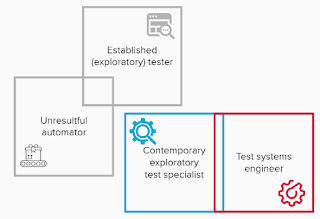

# In Search of Contemporary Exploratory Tester

*Published 2022-01-21*  
*Source: <https://visible-quality.blogspot.com/2022/01/in-search-of-contemporary-exploratory.html>*

---

*We had just completed our daily, and a developer in the team had mentioned they would demo the single integration test they had included. Input of values to Kafka, output a stream, and comparing transformation in the black box between the input and output. I felt a little silly confirming my ideas of what was included in the scope thinking everyone else was most likely already absolutely clear on the architecture but I asked anyway. And as soon as I understood, I knew I had a gem of a developer in the team. From that one test (including some helper functions and the entire dockerized environment, I had the perfect starting point for the exploratory testing magic I love. But also, I realized I could so easily just list the things pairing with the dev, and we could fix and address the problems there might be together. Probably, I could also step away and see the developer do well and just admire the work. That's when I realized: I had finally landed a team where I would not get away with the traditional ideas of what testing would look like.*

This week I have been interviewing testers and the experience forces me to again ponder what I search for, and how would I know I have found something that has potential. Potential is the ability and willingness to learn, and to learn requires wanting to spend time with a particular focus.

Interviewing reminded me of the forms of bad ideas:

- the developer who does not enjoy testing as the problem domain
- the tester who has not learned to program, think in architectures nor work well with business people (the \*established exploratory tester\*)
- the test automator who made particular style of programming manual tests to automation scripts their career (the \*unresultful automator\*)
- the total newbie who wants to escape testing to real work as soon as they can

I don't want those. I want something else.

So I came up with two forms of what I may be looking to fill from a perspective of someone to hold space for testing.

1. Test systems engineer
2. Contemporary exploratory testing specialist

**Test systems engineer** is a programmer who enjoys testing domain, and wants to solve problems in testing domain with programming. They want to apply programming with various libraries and tools to create fast feedback mechanisms to support the teams they contribute in. They won't take in manual test cases and just turn them to automation, but they will create an architecture that enables them to do the work smart. For this role, I would recruit developers with various levels of experience, and grow them as developers. A true success for this role in a team looks like whole team ownership of the systems they create, enabling them with a mix of test systems and application programming over time.

**Contemporary exploratory test specialist** is really hard to find. It is a tester who knows enough of programming to work with code at least in collaboration (pairing/ensembling), can figure out change by reading commits (as nothing changes without code changing with infra as code) and target testing for changes combining attended and unattended testing. Being put in a place where there is a choice of not ever looking at the application integrated as there's appearance of being able to do all in code, this would choose to experiment what we may have missed. Nudging left and whole team testing would be things - not waiting to the end of the pipeline, but building and testing branches for some extra exploring, pairing on creating things, reviewing unit test, defining acceptance criteria and examples are some of the tactics, but everything can also be shared with the team. Meditating on what we might have missed in testing and understanding coverage are go-to mechanisms.

I think I will need to grow both. Neither are usually readily available in the market. And no one is ever ready in either of the two categories.

The better your whole team, the more you need to be a chameleon that just adapts to the environment - and holds space for great testing to happen.
