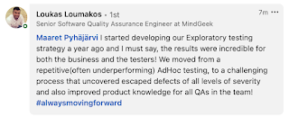

# The Artefact of Exploratory Testing

*Published 2022-05-05*  
*Source: <https://visible-quality.blogspot.com/2022/05/the-artefact-of-exploratory-testing.html>*

---

Sometimes people say that all testing is exploratory testing. This puzzles me, because for sure I have been through, again and again, frame of testing in organisations that is very far from exploratory testing. It's all about test cases, manual or automated, prepared in advance, maintained while at it and left for posterity with hopes of reuse.

Our industry just loves thinking in terms of artefacts - something we produce and leave behind - over focusing on the performance, the right work now for purposes of now and the future. For that purpose, I find myself now discussing, more often, an artefact of *answer key to all bugs*. I would hope we all want one, but if we had one in advance, we would just tick them all of into fixes and no testing was needed. One does not exist, but we can build one, and we do that by exploratory testing. By the time we are done, our answer key to all bugs is as ready as it will get.

Keep in mind though that done is not when we release. Exploratory testing tasks in particular come with a tail - following through to various timeframes on what the results ended up being, keeping an attentive ear directed towards the user base and doing deep dives in the production logs to note patterns changing in ways that should add to that answer key to all the bugs.

We can't do this work *manually.* We do it as combination of attended and unattended testing work, where creating capabilities of unattended requires us to attend to those capabilities, in addition to the systems we are building.

As I was writing about all this in a post on LinkedIn, someone commented in a thoughtful way I found a lot of value in for myself. He told of *incredible results* and *relevant change* in the last year. The very same results through relevant change I have been experiencing, I would like to think.

With the assignment of *go find (some of) what others have missed* we go and provide the results that make up the answer key to bugs. Sounds like something I can't wait to do more of!
