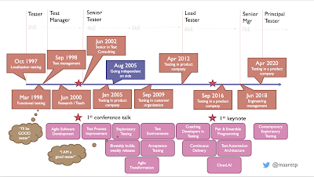

# The Five Year Heuristic

*Published 2022-07-12*  
*Source: <https://visible-quality.blogspot.com/2022/07/the-five-year-heuristic.html>*

---

As I am celebrating my 25th career anniversary this year, I find myself looking back at what I have done and where my career has taken me, and what contributions I may have had my share on. There has always been a day-job at testing something, and the hobby of learning from it and everything available, in scale of hours that don't fit a regular workday. Also, would not be *prioritised* same given the power over to my employers.

My hobby side of things has taken me to deliver that close to 500 sessions in 28 countries. It has kept the work side of things growing in ways I could not foresee, and lead in transformations of things I am interested in while still grounding on *testing* or rather testing both products and organizations, while embracing agency that allows me not only to provide information but to take part in doing something more with that information.

  

Over 25 years, I have had themes I am more into but I have not yet managed to leave a single theme behind me, even if sometimes I feel like it has been long enough since I cared for *agile transformations* or *organising acceptance testing in customer/contractor organizations* that I would prefer to think of them as things of past.

A quote also driving a lot of my thinking is:

> # “The future is already here – it's just not evenly distributed. *The Economist, December 4, 2003*” ― William Gibson

The quote for me does not [relinquish my agency](https://medium.thirdwaveberlin.com/heres-why-you-should-stop-using-william-gibson-s-the-future-is-already-here-it-s-just-unevenly-e5be2d9284f2), but reminds me that what I see in one place for software development is still future for another, and moving from organization to organization, project to project has a sense of time-travel.

Maybe it is the dizziness with what is future in a world of invisible (software), but this idea of looking at what we do lead me also to coining a heuristic that helps me ground myself a bit on my ideas. With 25 years of experiences, I keep going back to **the five year heuristic** - of when the experience I am sharing happened.

What being a new tester (or programmer) is today is entirely different experience than 25 years ago. But so is being a very senior tester in a new software project being recruited to a new organization.

It is worthwhile asking for each story I share from my experiences of *when* it happened. While it made me the professional I am today, especially I find the five year heuristic a good one for experimenting. Anything I haven't tried in last 5, I could try again for new experiences and results.

And I really wish some of the consultants who have been in this industry as long as I have, or longer, would also apply this rule and no longer live in the assumption that the experiences from an industry of a different era remain relevant.

Our experiences need replenishing even when the foundations remain, to notice some of our built in assumptions that no longer have to be true.

'
