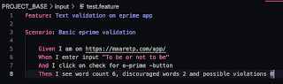
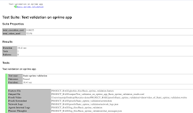
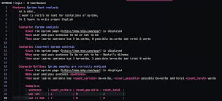
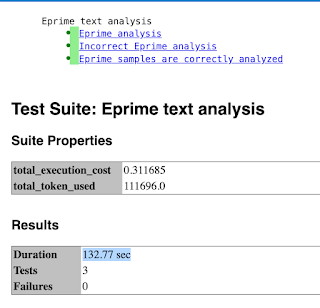
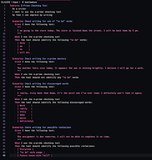
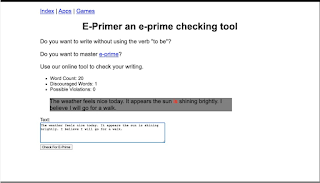

# Cost-Constrained Exploratory Testing

*Published 2024-11-18*  
*Source: <https://visible-quality.blogspot.com/2024/11/cost-constrained-exploratory-testing.html>*

---

The world of software used to run on-premise, and the basic promise was this: you buy a computer of the expensive sort, "server", and whatever you do on that ever since costs little. We did not calculate electricity or operations team attention to that server, it was just there. Costs were essentially there but distributed and hidden.

Then we got the cloud and now we pay per use. I can't be the only person who caused 2k€ extra costs on her 1st month on cloud use by not understanding all aspects of pay per use and differently priced services, but once burned, I have been more cautious.

With that cost caution in mind, I set out to observe my thinking and actions when trying out a new genAI tool published today, Hercules, <https://github.com/test-zeus-ai/testzeus-hercules>.

I loaded some money on my personal OpenAI API account. I verified that my settings would lead me to losing the money I loaded but no more. I created the API key I needed to run Hercules.

First four tests I explored cost me 0.36€. Two later, I am at 1.13€ and well aware of cost of exploring. I also note that awareness of the cost makes me consider somewhat more carefully what I will try.

**Hercules?**

The high level promise of Hercules is to do agentic transformation (fancy way of saying multiple LLM calls within a logic frame that could be just about anything) of Gherkin to test results. So given this:

I get this:

No code written. Annoying level of detail with entering inputs, pressing buttons and all that, but a pass as it *should be* for this case.

That was my exploratory test #2. The first one skipped line 7, resulting in a fail because you have to press the button to see the results. Tests #1 and #2 cost me 0.18€, and did not scare me off on cost-constrained and cost-aware exploratory testing I was on.

With test #3 I invested changing the level of language for my gherkin file. Adding the URL to my gherkin examples for my exploratory testing foundations course, I went about seeing what would happen with three tests in single feature file, where one test is two tests parametrized totaling this to four tests,

  

Again a green run. Three tests not four, but watching video evidence of the last, both sub scenarios were included.

  

Where test #2 execution cost was 0.085, this one cost me 0.312. Whatever the unit, because it did not match what I ended up seeing on the costs panel in openai portal.

Test #4 I dedicated to seeing a test fail for the right reasons. Taking *incorrect prime analysis* and setting expected values to to calculate 8 words for "to be or not to be - hamlet's dilemma", I indeed got the fail with an unexpected error analysis. The words on my tests and on the UI for the concepts don't match literally, and I wrote them in a different order, and yet the connecting of concepts hit the mark and compared right things.

Tests #1-#4 cost me 0.36€ to run.

For test #5, I was sure I would end up adding to the cost. I took a screenshot of the application and passed the screenshot to Claude asking for Gherkin feature file.

  

Not quite perfect scenarios. *Discouraged words* is a concept that is completely misinterpreted, but that also tells about the UI concepts not being intuitive. Example for *e-prime mastery* tries to avoid the verb 'to be' but ends up still having one amongst the avoided examples.

Running the test, I start to see 429 responses from the API - asking too much too soon, at least as per my cost aware settings and after some minutes I decide to not risk the cost, paying 0.50€ for this one failed experiment. Failed as in did not produce the report, but did produce some of the videos.

  

Video showed me that not specifying where the app I want tested results in testing eviltester's version of the same. First hit on google and all that.

The three first tests resulted in *failure.* Will be is not be, and other imprecisenesses in the scenarios end up requiring some more work.

<failure message="EXPECTED RESULT: The tool should identify the verbs 'am',

'is', and 'will be'. ACTUAL RESULT: The tool identified the verbs 'am', 'is',

and 'be'."/>

Final test #6 was against a live system of a pair I tested with. We tested search, with a passing test, ending up at €1.13 for my out of pocket cost for exploratory testing a new thing,

That investment pays me back a "coffee or beer" next time I meet the tool creator. Or when revealing pepsi max as my beverage of choice, a six pack of it. I ended up finding a bug on telemetry and the bug ended up being fixed and fix deployed already.

**Conclusions**

Every time one explores under a constraint, it has an impact on thinking and resulting intent on action. Cost-awareness drives me to think about what information I am seeking before hitting the tool.

Costs are one side of the coin, but we do pay a lot more for people figuring out locators and clicks to implement what gets generated here.

Costs drive reuse, and wishes that we would share the scenarios so that we don't have to rerun the same. Learning from what others already paid for is in the future.

Generating worthwhile gherkin might still be a human effort for now.

Replay without the GPT 4-o cost would be nice but we did not find it - yet.
