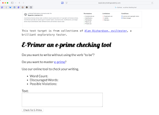

# An hour and a half of intentional contemporary exploratory testing

*Published 2025-08-22*  
*Source: <https://visible-quality.blogspot.com/2025/08/an-hour-and-half-of-intentional.html>*

---

Thank you for a CGI product development team on making space for us to have a 1.5 hrs learning session on exploratory testing in your team day. We did not test our own products, but we tested a test exercise, and we tested with intention.

First, we brainstormed what we would do first on this specific application. Would we just click on the button with an empty value? Would we emphatically rest our hands on the keyboard to generate some text without meaning? Would we do a short sentence or a wall of text? Would we try special characters and only special characters? Or something different?

We then talked about our options. We could choose to read the wikipedia page to figure out what is this e-prime anyway. We could design from our experiences a sentence that is with, or without the verb "to be" as we read what is available on the screen. Someone then proposed something I could agree with: "Let's type a bit of Shakespeare" and 'To be or not to be, that is the question' was chosen as our first executed test as a group.

Immediately after concluding it works, we documented that in automation, run the automation and confirmed we now had executable documentation. We also saw automation fail, just to gain trust on our tools.

Now we had the choice: we could list our other inputs to this text field directly into automation. Or we could attend to the user interface first, and document after. This time we chose the latter.

We then got to me pointing out there is a bug I know of, where it works on Safari but it does not work on Chrome. Brainstorming what could break with browsers concluded as we don't really know. It's easy to know after, but it is hard to know before having tested. If you feel like trying, it's long text that will make the bug visible.

With 28 known issues, we found five. We slowed our decisions to snail pace, so that we could all move together and make deliberate, intentional choices. It's a whole day course for me to teach how to find all the 28 that I am aware of.

The assignment for #ContemporaryExploratoryTesting is to make the paper with invisible ink listing of bugs visible, focusing on information that is relevant. The scribblings may include things that are just noise and we need to intentionally steer away from. Are your testing results intentional or accidental?

Like someone from the audience concluded: they don't teach testing like this in school and they should.

If your testers need to learn to test, I know how to teach this. We know nowadays wider at CGI how to teach this. And asking for better testing is growing as I'm here for #scale.

*I wrote this first into my LinkedIn posts queue on socialchamp that I am now experimenting with, to realize this was a moment where it was already a blog post size. Creating content for LinkedIn should really not be my thing so I write it here instead.*
