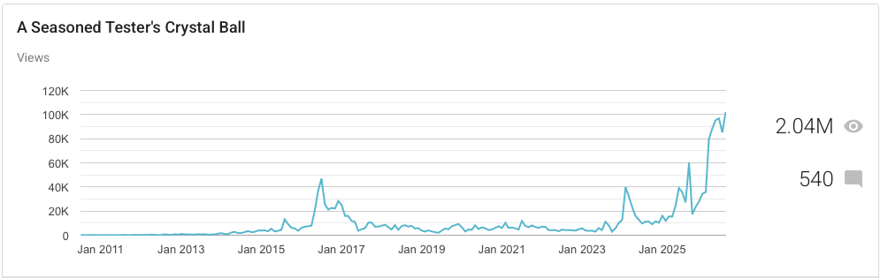

# Public notetaking, a 12 year sample

*Published 2026-08-28*  
*Source: <https://visible-quality.blogspot.com/2026/08/public-notetaking-12-year-sample.html>*

---

When I started this blog, I called it **Seasoned Tester's Crystal Ball** and wrote down the tag line that has remained unchanged since:

> This blog is about thinking of things past, present and future in testing. As much as I'd like to see clearly, my crystal ball is quite dim. Learning is essential and this is my tool for that.

I did not foresee that a blog since 2010, 12 years of public notetaking on twitter 2010 - 2022, and four years of public notetaking on mastodon 2022 - 2026 would realize the vision of being a tool for my own learning. I imagined reading back to what I thought in the past, laughing about how naive I had been, and how little I knew even if I was already seasoned **16 years ago**.

I did not foresee when I started this that I could spend a Friday evening, AI-assisted, finding things I have said on twitter worth quoting even now when all that material is deleted but archived in internet archive (please donate to it, they do such great work) because I set up for it before I deleted data from what used to be Twitter's servers - at least, that is the theory.

What I set up today is what people call a **second brain**, basically a structure of routines that pull together your sources of notes to a structure in an Obsidian multi-vault structure with LLM wikis, allowing my AI harness access to all this public information that I had already classified systematically, giving me thematical learning opportunities on things I might benefit from for me, but not pay attention to.

So when I pull out of this material, it's not generated text. It is my text. 16 years of my text, and 12 years of my text on twitter. So I wanted to share what I pulled out on my 12 years on **exploratory testing**.

As per this blog, it is as much public notetaking as any. I hope google's interests to have my texts around stay (blogger). I hope Microsoft's interests to have my texts around stay (github). And I hope internet archive stays when the corporations don't. What I wrote is my legacy, and I have been planning for maintaining that digital legacy for some time now with choices I make. Robots and some people have hit this blog 2 040 234 times, so my small contribution to the teaching ideas for AI without risking a copyright violation counteraction as I share with CC-BY license making my intent of use what you can clear.

## The 12 year sample of me quoting me

These things are a condenced, thematic digest where selection is delegated while the source remains me. It's drawn from my personal Twitter archive covering 2010-2022. As it emerges, I spoke particularly to 11 themes:

1. What Exploratory Testing Is (core concepts — mindset, learning, agency)
2. ET vs. Scripted Testing (test cases as output, not input)
3. ET and Automation ("contemporary exploratory testing," the automationist's gambit)
4. History and Attribution (your research into Cem Kaner, Elfriede Dustin, the 1984/1988/1999 dates)
5. Defending the Term (pushback on deprecation and "ad hoc" framing)
6. Teaching, Courses, Mob/Ensemble Testing, and the Book
7. Community and Peer Conferences (ET Dinners, DEWT, ET19)
8. Managing Exploratory Testing (charters vs. sessions, agency)
9. Developers and Exploratory Unit Testing
10. Personal Journey and Career (2010 → 2022 arc)
11. Craft Notes (bugs, serendipity, real sessions)

This topic was 1304 tweets out of 33551, and I have yet to dig into what else did I talk about as I felt I was always on this topic.

## 1. What Exploratory Testing Is

Not a technique or a phase — a mindset built on learning, agency, and opportunity cost, whether or not you touch a keyboard, script, or piece of automation.

- "Exploratory testing is more of a mindset emphasizing that you need to learn continuously. Every day a little better. Love my work."
- "Agile testing is the idea that developers can test, and that testers can contribute before development. Exploratory testing is the idea that testing is skilled activity."
- "This testing the verb vs testing the noun is very useful. Been thinking for last few hours how ‘all testing is exploratory’ is true for the verb but not the noun."
- "Exploratory Testing makes many uncomfortable because it requires decision-making. You are responsible for results and you decide how you get to those results. You decide, you are wrong (or right), and you learn."
- "Bugs, by definition, are behaviours we did not expect. What sets Exploratory Testing apart from the non-exploratory is that our reference of expectation is not an artifact but human imagination supported by external imagination of the application and any and all artefacts."

## 2. Exploratory vs. Scripted Testing

Test cases are a valid output of exploratory testing — never a valid input.

- "Scripted vs. exploratory continuum just doesn't clarify it for me. I often create the script after I've explored. Hands-on with sw first."
- "If test cases are input to your testing, it's most likely not Exploratory Testing. With Exploratory Testing, test cases (and documentation in general) is output."
- "As an exploratory tester, there is one thing I create 'test cases' for - bug reports. That's when writing step by step repro instructions may make sense (if I can't avoid it, and I often can)."

## 3. Exploratory Testing and Automation

From around 2018 on, the central thread: rejecting the manual/automated split, reframing automation as something built *through* exploring — leading to 'contemporary exploratory testing' and the 'automationist's gambit'.

- "What's with the idea that I need automation to free my time for exploratory testing? Assumes devs can't do decent quality without automation"
- "The new tools ‘automating exploratory testing’ are to that goal what IDEs are to ‘automating programming’. And that’s helpful. I love an IDE with great refactoring support. It makes coding more joyful. But we rarely say ‘automated refactoring’."
- "I woke up realizing this is a perfect way to describe what I do with Exploratory Testing. I have the automationist's gambit to it. Like with queen's gambit in chess, this has attacking prowess and has requirements for opponent to defend properly. Inspired. Thank you Chris."
- "Exploratory Testing is the pink. It keeps everything else in shape, and fills all the gaps."
- "Comfort in my peers also thinking that the "exploratory testing cloud on top of testing pyramid" and "let's slap some exploratory testing after everything else is done" are ridiculous notions. You can't automate well without exploring. You can't explore well without automating."

## 4. History and Attribution

Amateur historical research into where the term actually came from, and pushback on narratives crediting it to one person.

- "Brief history of Exploratory Testing. Introduced by Cem Kaner in '80s to describe smart way real companies were doing testing that was different as it avoided separating test design and test execution, maintaining tester agency and learning."
- "1988 'Testing Computer Software'. Cem Kaner. We have added more understanding to the concept of Exploratory Testing since it was coined in 1984."
- "I know from personal conversations with a now-retired head of testing at Social Insurance Institution (KELA) that they were doing Exploratory Testing before Cem Kaner coined the term. Reading about their early computer work in HS today (in Finnish)."
- "Way too many people ask me to credit James for "exploratory testing". Like the concept somehow belonged to him. Newsflash: I was doing it before I learned James exists. I found out about James existence researching ET at university."

## 5. Defending the Term

Pushback on attempts to retire, rename, or diminish 'exploratory testing' as vague, unskilled, or synonymous with 'ad hoc'.

- "I have spent 25 years of my career exploratory testing, a concept that is 34 years old. Saying I should stop being what I am because there was a jerk using the word... Does not leave you with many words."
- "Service announcement. We have not retired Exploratory Testing. We are rediscovering it. Love the stuff from Anne-Marie Charrett, James Lyndsay, Alexandra Schladebeck and Simon Tomes just to mention a few are doing on it."
- "There is a reason why people conflate exploratory testing with ad hoc / monkey / no discipline — their colleagues hide the discipline or lack the discipline. Mystifying it is hurting us all."

## 6. Teaching, Courses, and the Book

A teaching practice and a self-published book, plus popularizing 'mob testing' as a way to teach exploratory testing experientially.

- "It’s started: Exploratory Testing Book in now in progress and first increment is on LeanPub"
- "I enjoy the two day classes on Exploratory Testing as we learn to work together and go much deeper on testing and the application."
- "This week I taught a course on hands-on Exploratory Testing. Still reflecting on what I learned from it myself. The first major learnings bubbling up are about what to call the course. I could call same contents "Test Case Design" or "Agile Testing", more people would find it."
- "I'm doing a complete 2022 rewrite of my book on Exploratory Testing and the old version will be replaced with increment of the new already today."

## 7. Community and Peer Conferences

In-person exploratory testing communities in Finland ('Exploratory Testing Dinners'), later international peer conferences.

- "Great discussion at Exploratory Testing Dinner yesterday. Addressed reporting (again), cultural differences and bug reporting this time."
- "We'll organize a peer conference for European teachers of exploratory testing to learn from each other. Netherlands or UK? #DEWT5"
- "#ET19 has a nice mix of people who have taught Exploratory Testing to thousands and those who practice it. I’m hoping to rediscover it as the ‘smart testing not everyone was doing at the time’ it was used for 35 years ago."

## 8. Managing Exploratory Testing

Against treating session-based test management as the only, or best, way to manage exploratory work — agency is the real lever.

- "It would be just as bad to create / fix all charters for exploratory testing beforehand. Unadaptive planning."
- "Exploratory Testing isn't this thing where you create big test cases and call them charters. If you think you can create charters and pass them around in your team, you are learning on a short leash that limits you."
- "One of the most common ways of managing Exploratory Testing is 'stealth'. We hide it and focus on what the organization expects. I'm seeking for ways to stop hiding it, because it is what makes our testing worth doing and our test automation worth having."
- "Agency is at the core of Exploratory Testing."

## 9. Developers and Exploratory Unit Testing

Exploratory testing happening at the unit-test and code level, not just at the UI.

- "I’m lucky to work with devs who are just as good exploratory testers as most of the testers. The ‘focus makes me better’ myth of testers that died with continuous delivery."
- "What does it look like when developers do Exploratory Testing? A lot of times it looks like they make better unit tests. They go about and learn about their application also in integrated context (and don't make excuses in it not being their job), but lessons turn to unit tests."
- "I'm taking a moment to dig into exploratory unit testing. Yep, that is a thing. That tends to be how some of my favourite TDD folks get to good levels of quality, raising the bar on their intent and closing the results gap."

## 10. Personal Journey and Career

A 25+ year career arc, from an early job where a team lead handed her Cem Kaner's book, through introducing exploratory testing to skeptical organizations, to pushing back on being boxed in as an 'exploratory testing guru'.

- "If one get paid more for "planning" testing = documenting than testing, exploratory testing may have difficulties."
- "Changed from product business to pension insurance to show exploratory testing is possible there. Made significant progress today."
- "I've identified as a context-driven tester for a really long time, and I am now coming to terms with not being that any more. I choose places of work that allow for smart testing ('contemporary exploratory testing') and do transformations to it."
- "I was in someone's job interview today and they boxed me as "exploratory testing guru". While it is great to be guru, they were completely out of touch with my work on contemporary exploratory testing and I'm off the box."

## 11. Craft Notes: Bugs, Serendipity, Real Sessions

Texture from the practice itself.

- "The bug treasure troves for exploratory testing practice: airline pages. I wonder if they’d like to know of all the bugs they have."
- "I'll share you my favorite Albert Einstein quote: "It's not that I'm so smart, I just stay with the problems longer". I've connected that idea with good exploratory testing for years."
- "Three hours of Exploratory Testing with three different constraints on the same application. One produced 7 cases in test automation, 2 bugs. One produced hundreds of unstructured test ideas, tens of bugs. One produced a mindmap, 4 bugs. All but one of the bugs were different."
