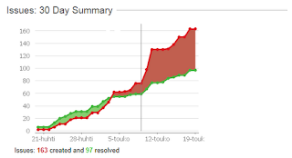

# An evening eye-opener

*Published 2012-05-19*  
*Source: <https://visible-quality.blogspot.com/2012/05/evening-eye-opener.html>*

---

For Saturday fun, I'm reading Gojko Adzic's book Spefication by Example. Not for the first time, but I thought this time I'd try read it in order intended, instead of the usual jumping to the most relevant first.  
  
On the very beginning of the book, describing key benefits of Specification by Example, there's a quote. Paraphrasing: In other organizations in the end testers find something wrong with the product and developers need to continue, and in ours they don't. The issues that the team have are about making a test (automated) go green, not later feedback surprises.  
  
I got stuck on this particular out-of-context quote, namely because it, unintentionally, resonates with something I'm experiencing. Not specification by example and hitting the right target, but being in an organization where the issues used to be "tests not becoming green" and now there's definitely more churn - going back and forth.  
  
To illustrate my story, I'm sharing a picture from our Jira that I've been looking at recently, trying to figure out what to do next.  

Something happened a while back. Something that makes our software development look a lot less effective. They got their first tester that focuses on testing. They had at some point before a tester who focused on test automation, and with that, the wrong kind of test automation, so much of what I'm showing come as surprises.  
  
It's not that you couldn't use the product. Apparently you can, since there's customers using it. And apparently they can't be very unhappy or they would complain in ways our people would understand. I'm not quite sure what's happening there.  
  
But I know what is happening testing-wise. I started testing and logging my issues a bit before out latest release. And the stuff I'm finding for addressing is more than the fixing / development work of our whole team.  The problems are not about missing requirements per se, but about surprising side effects of two supposedly separate things. They are problems of shortsightedness about things that can go wrong and believing you'd be luckier than the others. And not knowing hides it all.   
  
I had organization, who could have no exploratory testing and no churn. No real information either. Having e.g. me work on anything like specification by example & test automation now would seem like the wrong choice, as they need quick eyes open effectively reported -testing first. But I still kind of hope to get to that too, to turn the trend around for better.
