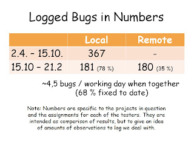

# Thinking around numbers

*Published 2013-02-23*  
*Source: <https://visible-quality.blogspot.com/2013/02/thinking-around-numbers.html>*

---

Doing a trial webinar (with real content I had not talked of before in that detail) on Experiences with Remote testing, I had questions related to one slide that left me thinking for hours.  

The numbers you can see on the slide show two trends:  
1. I've logged a lot less bugs since other, remote tester joined  
2. My bugs on the timeframe with us too have been received better as in fixed in higher percentages  
  
The questions were related to the percentage of fixing - why is there such a seemingly significant difference?  
  
I had looked at the data under the numbers while I created the slide, and my impression was - which I also told in the webinar - that it's due to the essentially different assignments each of us takes. That the remote tester may be asked to test something that is not yet in use but is going out, but I might be testing something that is already in use for significant numbers of users. It's not quite so simple.  
  
There's two projects we need to work on. To keep things simple in the start, I've been the one who jumps between the two and have allowed the remote tester more focus to learn one before jumping between the two. This was also as the other project we both worked on is more business-critical, and the one only I worked on is completely new product that saw its first release in December.  So the remote tester has only worked with the "established, already in production but new features added" product, whereas I work on both that and a new product.  
  
Similarly, the features we've worked on have been in quite a different stage for development. The bigger numbers on time before Remote tester joined, show me participating on a major refactoring effort where basically an area was redone, and we were quite keen on making sure its better quality-wise than before. She's worked on areas that are "ready" and in production, showing problems in areas that are not otherwise changing and finding people to take the areas and fix the issues has been different.   
  
Splitting the percentages to compare per project / product, the fixed percentage is for the old-and-in-maintenance Local: 44 %, Remote: 35 % and for the new-product Local: 90 %,  Remote: 66 %. But, remote tester has only 3 issues logged in the new product as she as worked on that for less than two weeks. All of a sudden, the difference does not seem quite so drastic - I just factored in the two products that have a different working atmosphere for testing.   
  
Another thing that impacts both our numbers / percentages with the in-maintenance -product is a change in our bug process that was taken into action quite soon after the remote tester started. Now all bugs we report go first for triage with the product manager, who is super busy and finds many things more relevant than telling something must be fixed right there and then. The product manager worries that if she rates the bugs as important, she loses some of the features she wants from the increment. And judging if the bug is newly introduced or not is just as much work for the product manager as it is for the testers - and we end up leaving even more tails of quality debt than before. The change was done as there was, with two testers, so many things to go through for the developers that the project manager felt the need of protection - with side effects. We're getting just again to the point where this bottleneck is relieved again - shows in the bugs that we've been trying to solve in the last months being solved in last week, allowing the freedom of choice back with the developers.    
  
Then there are smaller factors to the numbers. I get my numbers up by logging issues I identify from us talking or from logs - I dare to assign work for the developers even if I haven't done all the possible investigation myself. There's one of me, and there's 8+4 of them - none can assume all testing is done by me. And I find the work to assign by talking with them, that's something I get from being local. I also avoid logging, as my favorite phrase turns out to be "will you fix it today or do I need to put it in Jira". And I can raise priorities of the issues I log by talking with the developers, bringing them to a point where the analysis was done together so there's no reason to not fix anymore. I can go around the ridiculous process change, whereas the remote tester can't.   
  
And one factor is that as there's so much work, I don't bother reporting things I know we wouldn't address right now. I'll do that later. So, I tend to be more connected with what is happening in development and what are its guiding principles, and am able to use the information to target my messages of bugs better. But I've had six months more to learn what they don't care for - and what I can make them care for.
