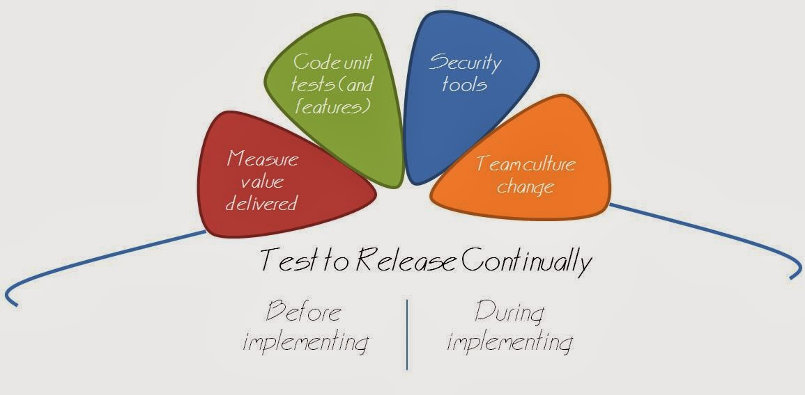

# Collaboration review - take the driver's seat

*Published 2014-03-26*  
*Source: <https://visible-quality.blogspot.com/2014/03/collaboration-review-take-drivers-seat.html>*

---

I had my collaboration review today. You know, the annual routine of discussing how you did and how you will develop, the routine that I'd prefer to just become a natural way of how we work together continuously. And as usual, as I want things to be different, I tend to take them differently and pretend I don't know how others do it.

As so many organizations I've been to before this, there's a form to fill out that presumably guides the discussion. The bits in the form are supposed to be filled in collaboration with your assigned manager, and they include points like feedback on the previous year.

  
  
What I enjoy most is taking the routine where someone else plans my future with me into my own hands - it's my future anyway. So I stopped to reflect on stuff I've done over the past year, things I've learned and things that I keep on avoiding.  
  
With the feedback taken care of (doing good job, and my enthusiasm to seek better ways is still surprising to my manager in the difference to the status quo he is used to)  we quickly moved to talk about stuff I would like his support on.   

With my preparations, we walked through areas of my work. And as a result, I draw up a silly picture of it.

What I mostly do is testing - with the recent changes, finally with a focus of delivering continually whenever a feature is ready. Continuous delivery is new for my team, we just started with that this week so that will be still the baseline of a lot of what I will do this year. I work with test perspective before implementing anything, and will help with feedback while implementing so that we complete the delivery together. The 'before implementing' seems to be a bigger challenge with us, with a short-term history of delivering the same thing a few times as we learned together too late. I'm pretty comfortable testing and would seem to deliver value in the team in just that. Yet, the application and our implementation does not bring me so many learning experiences right now, more on repeating the lesson on the difficulties of making the choices of what to spend time on and how to track what I learned by now to build on.

On top of that, what I need to work on is my skills on helping the team change its culture. People are much more difficult than our application and how it would be tested if I did the testing. We have somewhat of a role-based idea to software development, where developers do just implementation and I need to continuously work with practical ideas of how we could not assume that the one tester (me) will do all the testing. We'll need a bit more of team building and goal setting work, and it was nice to notice that a team building budget can result from discussing how this goal of mine could be supported by the organization.

Another area that I felt I wanted to seek into my goals is working on how we measure value delivered. I want to work out ways of seeing if (and to what extent) we're actually delivering valuable features, to move away from counting the tasks. In the last year we've learned that being busy and delivering many "Jira issues" may not tell anything about the value outcome - especially if we redo same things over and over again. Learning to talk about value we deliver might also help with breaking the silo thinking that keeps popping up.

Third area I brought on the discussion was that I will start coding with the team. Reviewing the code, adding unit tests, and adding features. I realize I will be limited with this, as the trouble still is that while I test I see problems that are there, and others in the team miss them. And I will do much of this by pairing with the developers, who refuse to pair on stuff that I currently do "my way" - exploring. But taking this into my goals of what I do will help me with two things that I hold dear: I get to prove a point of skills being learnable (if I code, why the developers couldn't keep their eyes and mind open when they test) and working on the automated checks on a level where we as a team can't escape into the "task is done but the value isn't delivered"-mode we so easily slip into.

The final bit on my things to do is the smallest: I wanted to reserve time this year to work out how to run the basic security tools on our software.

I look forward to another great year of learning. Apparently I'm the only one in my team who actively sets their own direction and negotiates on the contents of the work, but I also feel the reward is that I do get the support I need from my manager. No magic wands available, but a helping hand and perspective.
