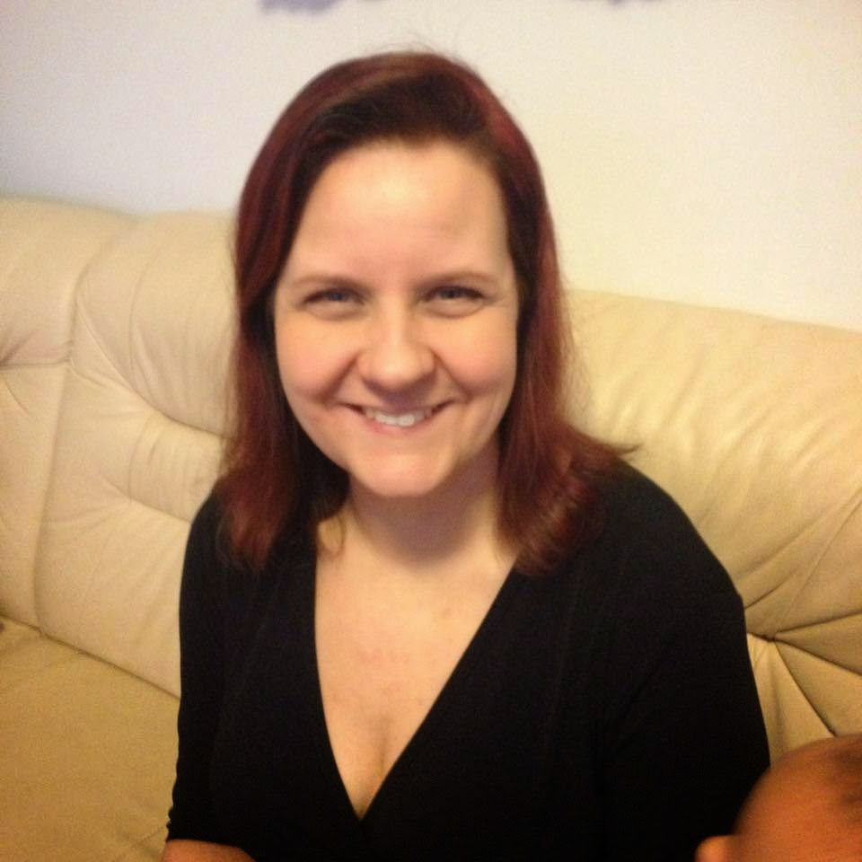
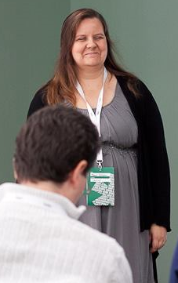
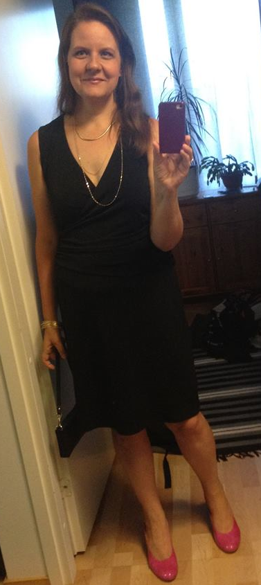

# Taking stock of 2014

*Published 2015-01-08, updated 2018-12-26*  
*Source: <https://visible-quality.blogspot.com/2015/01/taking-stock-of-2014.html>*

---

A friend of mine tweeted today that 2 % of year 2015 is already behind us. It woke me up to realize that I'm very much out of my usual practices related to change of year, as I have not yet tried looking back to what the year was and what should this year be. I'm not big on new years resolutions, but with all this agile and continuous change, I find the regular rhythm of stopping and seeing bigger things extremely relevant.  
  
My big thing for new years seems to be to learn more, within the context of understanding more about contexts and how to do great software (testing) with different kinds of organizations and people. And I find sharing what I learn amplifies my learning and makes me more driven - challenges me.    
  
**Becoming International**  
  
Being more connected with the international testing community was something I wanted for 2014. I took the easy route to be more connected, being active on twitter (now with 920 followers and a great number of people I follow) and blogging actively. I have published 62 blog posts in English in this blog, with 27239 clicks in 2014. I've been delighted to see that Software Testing Club has noted several of my posts, and that [Joris Meerts, tweeting as @testingref](https://twitter.com/testingref) regularly tweets links to my posts to the testing audience. Comments / discussions -wise it has been quiet, more quiet than I would hope for.  
  
I managed to publish an article in Testing Circus on using Rapid Reporter. There's a few articles I'm working on, that I hope to finish in 2015, and will publish more to contribute for Women Testers, Testing Circus and Software Testing Club.    
  
I was helping out Mieke Gevers with Belgium Testing Days, organizing Test Lab for the conference with my close friend Ru Cindrea, and on that conference met several people. I found respect for Lisa Crispin, as I watched her work remotely in the hotel lobby to help her team make a release at Belgium Testing Days - her contribution in the team, something that I find very hard to grasp from the Agile Testing book. I got a chance to meet [Richard Bradshaw](https://twitter.com/FriendlyTester) and really look forward to bringing him to network with the Finnish Testing Community. And I met [Huib Schoots](https://twitter.com/huibschoots) and Joris Meerts in person.  
  
Twitter-wise, I feel I have found some great ladies to network with: Ann-Marie Charrett, Katrina Clokie, Amy Phillips,  Jyothi Rangaiah, Ulrika Malmgren, Teri Charles, Helena Jeret-Mäe. I follow them all closely, in addition to ones I already had on my list before this year. Ladies seemed to be a theme of the year in general, as Jyothi kicked off women tester magazine that I have yet to contribute to.  
  
We also had international guests in Finnish Testing Conferences, and I got a chance to talk more with Iain McCowatt, Shmuel Gershon, Alan Richardson and Ilari-Henrik Aegerter. I noticed I have a pretty good track record on getting my suggestions of who to invite through with the Finnish conference organizers.   
  
I also co-taught BBST Foundations with Cem Kaner with Altom with an audience of Romanian and Finnish testers. BBST is a great online course that has even greater version by Kaner Fieldler Associates than the AST's free one. And I became a supporter of the idea that we should pay for online courses to support sustaining the contents and developing them further.   
  
Becoming international is really the theme, as I also ended up submitting talks to international conferences and thus will be speaking in 2015 at TestBash in UK, STPConference in US. I was also invited to hang out with DEWT on Strategy in the Netherlands - peer conferences where everyone comes with an experience, will see if I deliver mine or not.  
  
I also decided to start chasing a dream of relocating outside Finland, which must have something to do with the fact that I just turned 40 years of age. At least that is what my team's developers say. The dream chasing became more pressing, as I fell completely in love with a man from US and really would want to spend time with him. Thus the end of the year has been colored by efforts in starting to look for a job in San Diego.   

**Being Local**  
  
As always, I'm a networker and learn from people. Whenever I had an idea of something I wanted to discuss, I would organize a meetup. And I organized many, locally in Finland. I started a new non-profit on Context-Driven Testing with Soile Sainio and Sami Söderblom called Software Testing Finland (Ohjelmistotestaus ry). For the non-profit, I blogged semi-regularly in Finnish for the autumn. And I still continued to volunteer actively with Agile Finland, which included also organizing Tampere Goes Agile -conference for the second time.  
  
In addition to organizing a lot more, I did a few talks and trainings myself: 13 was the total for 2014. I would actually like to get back to doing more of contents and less of organizing, and that's something I'm working towards with Agile Finland deciding to hire it's first "make-it-happenizer".   
  
**Changes of Focus at Work with a Personal Crisis**   

Weird enough, my work at Granlund became work in 2014. It was no longer the center of my universe, but it is still very much something I enjoy. With an effort on in-team communications and pairing to fix bugs without reporting them, I ended up logging 535 bugs. My focus moved from finding as many relevant bugs as possible with two products into being a full-time team member with just one product.  
  
Our team took huge improvement steps. We moved from TFS to Git in Visual Studio, and learned to do continuous deployment. We stopped estimating effort, and take baby steps towards focusing on flow. Communication and collaboration improved a lot. And there's all the time in the world for testing a change before putting it in production, as it is no longer the last check but a relevant part of how we do things together. We also learned to talk about requirements and what we're implementing so that we managed to turn around the trend of rewriting features when I joined in later to test them. No Specification by Examples (yet), but just talking about what we'd expect with the whole team and the business representatives.  
  
I also turned the managers around in their "no international conferences" policy, getting two of our developers to fly over to an unconference in Romania. This was something everyone in the team swore that would never happen. And I got the biggest compliment ever, being named the team's "catalyst" - just being there makes things happen better.   
  
On a personal level for work, I started the long and hard route towards being more of a developer to get rid of excuses my team's developers have on skipping their shares of testing. And the one developer who told me that women can't code was probably just presenting a challenge I need to accept. And I had that challenge written in my personal goals in collaboration review.   

**Coding with Kids**  

My son started the first grade, which lead me to the natural idea of volunteering to do stuff on computers with him and his school mates. With trying out different things at home, we finally started doing things at his school with #HourOfCode -week, as I got to teach Angry Birds and Frozen Programming Basics to three different groups.  
  
Before that, I volunteered to join on teaching a TKP class (Teaching Kids Programming, Java) with 8-9th graders. I consider the idea that the local teacher now wants to continue teaching this class for spring term a great accomplishment.  
  
We also started some discussion on teaching kids programming in general. With that theme, I got to meet Linda Liukas and people from Finnish Ministry of Education, and look forward to turning that into actions in 2015.   

**More Focus on Personal**   
  
Even if I did more than ever on the professional side, I still feel 2014 was a year of personal achievement.  
  
A year ago, I told I had lost 28 kilos and I continued the project until my birthday, becoming in total 46 kilos lighter than I had been. I became addicted on dancing (zumba & sh'bam) to the extent that I would leave work early to go work out and not promise to do volunteer work if that would mean skipping my favorite dance class. Pictures perhaps speak louder than words on this. The square picture is very recent. The two others are before and after.   

  

  
As I mentioned earlier, I also fell in love, so much that it makes me fly across the ocean to spend time working remotely in San Diego right now - and actually for 8 weeks in first two months of 2015.  And I actively look for ways to relocate to San Diego, so in case you have hints on how to do that, I would very much appreciate you letting me know.
