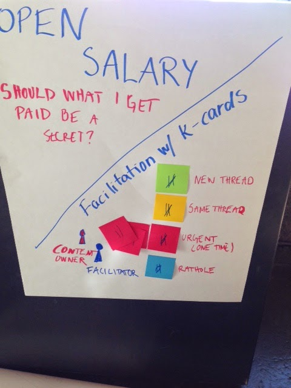
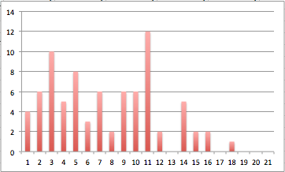

# K-Cards meet AONW

*Published 2015-02-14, updated 2016-08-02*  
*Source: <https://visible-quality.blogspot.com/2015/02/k-cards-meet-aonw.html>*

---

AONW (Agile Open Northwest) is a conference based on open space technology. It wasn’t my first open space, but it was the biggest open space I’ve attended so far. I joined with the idea of giving open spaces another chance, as I’ve never really liked them that much in the past.

On the first day of the conference, I was already getting upset after the two first sessions. I felt I didn't have the right personality for this style of conference. I’m not a quiet person and most people who know me refuse to see any of my introvert aspects.Withnew people, however,  I might be shy and polite. In a crowd in an open space where most people feel comfortable shouting their comments with great timing or just a little on top of each other, I was just feeling that while I had something to say, there was no room to contribute.

I could have left the sessions and moved to a smaller session, but the topics I participated were the topics I would have been interested in. And yet, I wasn’t able to get my ideas in, because of who I am and what I’m comfortable with.

In a session about women in tech, I felt particularly in need of commenting on something that someone else had just contributed, something that was a direct continuation of what was just said. I missed the window of saying that, and did not want to play the ping pong of going back to an earlier point, when we actually already switched the discussion thread.

I zoned out and paid attention to dynamics in the sessions in the afternoon. There was one that I really enjoyed, with a very small number of participants, and in particular, no dominating discussers (other than me perhaps…). But mostly I was paying attention to the fact that very small portion of people were discussing, and whenever the discussion was lively, we would do ping-pong between different threads so that the discussion was hard to follow.

I was seriously missing the [k-cards we use in context-driven peer conferences](http://testingthoughts.com/blog/26). These enable discussing one thing at a time and allow for people to get their chance of saying things without shouting over an active, dominating discusser. So on day 2, I proposed a session on “Open Salary” that would be facilitated with K-cards. The topic I picked up from discussion at a coffee table, noting it would be controversial and perhaps even a heated topic.Also, as the volunteer facilitator, I knew I would suffer if  I could not personally participate in  topic closer to my heart.

I set up the session with post-it notes of four colours, each pile of four with a number on them - a quick-and-dirty version of the actual K-cards. I made a flip chart with the colours and meanings, and started the session by explaining roles (facilitator, content owner) and cards as way of signalling your need to contribute (new thread, same thread, speak now, rathole). From the cards I created for participants, I could tell there were 10 people (plus myself) in the session to begin with. And during the session, one helpful participant introduced 11 more people joining in to the signalling system, getting up to 21 participants.

Since I was facilitating with the cards and numbers, I can go back to my notes of how the discussion flowed. During the 50 minutes of actual discussion, we had 9 new threads, where one person started two threads so I had 8 individual contributors. In total, 80 turns in getting into the discussion were asked for. Out of these, 4 were red cards, where the person in question felt what they had to say was so urgent they could not wait for their turn. Once a red card is used it is taken away, so they can't keep interrupting.

The longest thread was about willingness to share one’s own salary, that went on for 25 turns until three people flashed their blue cards, indicating the discussion wasn’t going forward anymore. In that discussion piece, we learned for example that the group had a scrum master with 120k annual salary and a scrum master with 65k annual salary, and that asking for 90k can result in getting 120k, so it’s not just about how well you negotiate.

Out of the first 10 people, everyone contributed to the discussion. Out of the total of 21 people that were there, 16 contributed to the discussion and 5 did not.

To show how the turns were divided, I collected the data together into a graph. The most active  person asked for 12 turns and on some of the threads had to wait for the people who had contributed less to get their say on the topic.

There were moments when I wished I was keeping better track of the threads.  I was also reminded how important it is to name the thread we are on and label it so that  the audience is able to  stay on a thread or know that they are starting a new one.

  

I hope something of this might stick to some of the participants and I personally was thinking about organising an open space where every discussion session could have a facilitator helping out the content owner. I know I would enjoy it more if I did not have to fight for my chance to contribute, and I’m pretty sure I’m not the only one who stays quiet and listens just for the unwillingness to fight your point to the right time between the other enthusiastic contributors.
