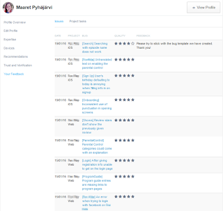

# The end of my crowdsourcing experience

*Published 2016-01-20, updated 2017-07-23 · Labels: Crowdsourcing*  
*Source: <https://visible-quality.blogspot.com/2016/01/the-end-of-my-crowdsourcing-experience.html>*

---

I tried testing on a crowdsourced project with Testlio from a direct request. I did not care to ask the pay in advance, I just thought it would be a fun experience.  
  
The testing part of it was a fun experience. If you love testing even a little, you might recognize the rush of getting to know a new application and finding problems there. You might also know the frustration when you need to find simple and basic bugs in functionality, knowing that those anyone could spot: including the developer who created the app in the first place. New project is always a rush of emotions, and new projects tend to end up with positive. This one was no different.  
  
While testing, there was already more of frustrations. The idea of shallow testing due to a short timeframe, in which you won't have time to investigate or dig deeper. The idea of paying only for sessions, when everyone doing exploratory testing knows that only some of your working time is in sessions. The idea of crowdsourcing downplaying what skilled testers can accomplish, for people who can't distinguish "testing" from "testing" and buy just any testing.  
  
I did two projects on the same application: testing on web for 2 hours 10 minutes, and testing on iOS devices for 3 hours 30 minutes. I logged 12 issues on web and 19 issues on iOS, and seems that I'm doing fine with accuracy/relevance. That's 11 minutes to a bug. And reporting properly takes time of course, since I would check reproducability, just like any good tester would.  
  
I got paid for the iOS project today: 20 *dollars* for an hour. The Testlio site says they pay up to 35 euros an hour, but even with a lot of experience elsewhere, clearly my first project was not valued that high. I don't know what the criteria of deciding on payment is, but with the payment I end up with "thanks for the experience, but there's better things for me to do with my time". At first I thought the pay was 10 euros an hour, but since the payout was only for the iOS project, so 18 euros (20 dollars).  
  
As financial comparison, let's do a bit of a calculation. Paying only for the effective testing hours means that the usual in-between-tasks time is included in the price. If you look at a full day of focused exploratory testing in session-based style, let's say that for 2 hours of testing, you would have 1 hour of off-charter time. You're still working, but not really on the charter. Digesting. Filling in gaps. Letting your brain bring things together. In this testing, for me it meant that I went back, unpaid, to close a bug I realized was duplicate. I investigated one bug further because I wasn't happy with what I new of it. I discussed with the project leads. Read instructions. Reviewed what other people had reported. And went back to check my feedback and issue resolutions.  
  
That 18 euros for an hour is now only 12 euros for an actual hour. I
would hardly volunteer to take a job that pays me 12 euros an hour,
including "holiday pay". That's the minimal pay in Finland, not the pay
for a test professional with 20 years of experience.   
  

  
Feedback-wise, my dislike of templates got me a lower score eventually. I get it: as a test lead on a project where you can expect low-quality investigation for bug reports, you believe less of people. If I don't mention my user account or my network for a typo that is available also without logging in, I must not have checked. Or I must not have the skills to know what types of bugs might depend on what types of things that I will report whenever they are relevant. And I definitely wouldn't actively learn from my mistakes, since I'm only paid for the hours when the bugs are first logged. Except I did, since I'm a professional tester.  
  
12 euros an hour might be much more lucrative for someone who
does not live in Finland. Crowdsourcing customers who want testers
specifically in the market / geographical area they target will have
less choice around here.    
  
With the pay settled and me valued to a lot less than I make in my day job, I choose to vote that my free time is more valuable. I rather change the world by enjoying new applications in an open source project that values my contribution.
