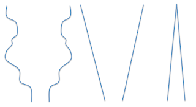

# Products as scrapbooks and modeling your way out

*Published 2016-03-04, updated 2016-08-02*  
*Source: <https://visible-quality.blogspot.com/2016/03/products-as-scrapbooks-and-modeling.html>*

---

I spent a bit of time with my team's designer to help model a particularly complicated area of features. I knew from having tested it that it was not good, but the discussion and our joint efforts into making it better made me realize more than what I knew from past testing of it.  
  
As I was listing concepts and features, and categorizing them while introducing them, patterns started to emerge. The assignment we were working on was to add one more feature to a complicated area. A feature described to us as "just add this dialog" made us talk about all the work we do to avoid building products like scrapbooks, and how hard it is sometimes to go beyond the obvious request.  
  
With each concept we listed, a pattern started to emerge and we started scribbling on paper. At first the user is handling a massive amount of data by default, then filters some of it out. But also adds some more while filtering. And then again there's selections to add more. And again filter more. A lot more. We calculated 7 different scoping actions in a seemingly random order, and realized it was no wonder we had hard time following through the area.  
  
From the first shape, it became obvious that this was not a good, clear and simple model for the user. So we draw concept shapes that would be clearer. We could start wide and consistently narrow down until we're where we want to be. Or we could start really narrow, and carefully widen up to be only at most where we end up wanting to be.  
  

  
Drawing silly pictures comes almost instinctively from modeling. The pictures help us work out which of the straightforward routes we can get our design into, but also, they generated a lot of ideas for me on how to fool the current system to reveal complicated bugs.  
  
Scrapbook of a product is a bug. But it's a bug that won't get fixed in an hour.
