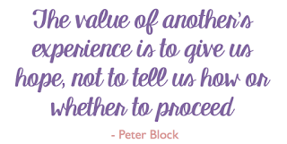

# Step back from roles, methods and definitions - the answer to how is yes

*Published 2016-05-15*  
*Source: <https://visible-quality.blogspot.com/2016/05/step-back-from-roles-methods-and.html>*

---

The role-discussion, and in particularly the style of rhetorics around it bother me. I've resulted in active walking out from twitter several times this week, just to keep myself from commenting and ending up in the discussion that I see as not going anywhere. Neither side hears the other, and both use strong expressions to change the others mind. I try to accept that I really don't need to change the other side. But I need to to, every now and then, express why I choose not to debate. It's not an act of not caring or being afraid, it's a choice of good use of time for things I believe to take things forward.  
  
As of now, I'm reading a book called "The Answer to How is Yes" from Peter Block. I'm only getting started, but the messages resonate. It talks about us getting entangled with "what works" over "what matters", and seeking out our answers in the how-space where things should be "Not our way, not one way, but the right way" even if there's actually many ways of doing this. Sounds like core to context-driven.  
  
A quote that lead me to start reading the book is this one - one that Woody Zuill uses to explain that he shares his experiences, not a method when he speaks of Mob Programming.  
  

  
Some 10 years ago, I remember a discussion with James Bach, face to face, where he told me that the peer workshops focus experience reports because whenever we would try to talk theory, we would just argue. Our experiences differ, but each experience is true. Each theory, method and definition that tries to generalize the world might not match all of our experiences.  
  
I believe the roles discussion is one where we should step back and talk about experiences, and respect that fact that is already obvious: our experiences on what makes a good tester (role) differ. And each of us can explain things from our experiences, instead of trying to argue for an absolute truth of how in a world where one might not exist.
