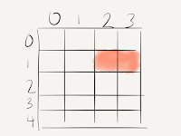

# Battleship TDD and ApprovalTests

*Published 2016-06-15*  
*Source: <https://visible-quality.blogspot.com/2016/06/battleship-tdd-and-approvaltests.html>*

---

Last Friday after #DevoxxUK (a java conference), we got together with a small group to try out a TDD mobbing kata. With a bit of discussion on what problems we'd find fun to work with, we ended up with Battleships.  
  
So we draw our first scenario with a Destroyer on a 4x5 board after the little tweak of not having a board that is symmetric.  

  
We write our test in English and translate each line to code. The last line is to check the board. And as  I've previously been introduced to ApprovalTests (as opposed to Asserts), there's a nice flow from the visual representation of our game into an ascii art form of the game.  
  

So instead of sampling assert at a time to represent core parts of the board we draw, we drew the whole thing at once as ascii art, saved into an .approved text file and then let the test guide our implementation.  
  
I've been to different TDD sessions over the years, and I've really grown to like more the Approvals-based approach as more visual and more as a thing that represents world as I know it. I had not really thought it much, but it's an ascii art representation of the thing we're thinking of that we save to a file.  
  
It's nice to be able to say in code  
  
Approvals.Verify();   
  
and move the rest of the describing end result into the text file over writing a pile of asserts.  
  
Similarly, I was thinking back to one of my first unit tests with Approvals, where we generated combinations of credentials, dumped them into a file and added nice and clear explanatory test around it. I've appreciated the clarity of that piece of documentation since.  
  
These just seem to map closer to something I feel at home with. So, I keep thinking about it. Maybe it's just me. But if it works for me, it might be of interest to someone else too.
