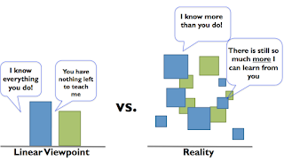

# Thinking you're the best

*Published 2016-11-18, updated 2018-10-27*  
*Source: <https://visible-quality.blogspot.com/2016/11/thinking-youre-best.html>*

---

I've been to organizations where we talk about "being the best". It kind of strikes a chord with me, in particular for the fact that I believe I'm really, really good testing specialist - and a decent software generalist too. But today, I'm thinking of the risks of thinking of being the best.  
  
If you think you're the best, you think there is nothing to learn from others, and in the fast-paced industry of software development, that attitude would be irresponsible and dangerous. If you are the best, you often view yourself as an individual contributor who may also fear being revealed not to be as perfect as she'd like to be when in collaboration settings.  
  
For years, I prepared in the previous night for every relevant meeting. I went in with a ready-made plan, usually three to prep my responses for whatever might emerge in the meetings. Back in school, my Swedish teacher made me translate things out loud every class, because of my "word-perfect translations". Truth is I had them pre-translated with great effort because I was mortified with the idea of having to do  that work on the fly.  
  
Through my own experiences, I've grown to learn that the pre-prep was always my safety blanket. I did not want to look bad. I did not want to be revealed. I was the person who would rather use 3 days on a half-an-hour task. And I would say it was for my "learning". It was for my "personality". But truth is, it was for my fear of not being perfect.  
  
This might explain why I'm nowadays such a strong proponent of collaboration: mobbing (safer) and pairing (personal stretch). When two non-perfect people work together, the result is magic.   
  

