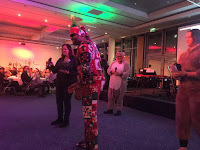

# 2016 - what a year

*Published 2017-01-01, updated 2018-12-26*  
*Source: <https://visible-quality.blogspot.com/2017/01/2016-what-year.html>*

---

I'm a big fan of reflection cadence, and it's time for one of those moments dedicated to acknowledging, primarily to myself, what I've made out of yet another year.  
  
**Changing the World of Conferences**  
  
February 2016 I introduced this tagline while opening the inaugural European Testing Conference. ETC is a platform for change.  
  
We're changing from *testers* to *testing* and bringing together testers and programmers to talk about ways they do testing, with practical, cross-discipline perspective.  
  
We're changingcompeting for speaking slot based on a *written description and reputation* to *oral explanation of your idea and experiences.*  

We're changing from *thinking free entry is enough of compensation* for speaking to *paying speakers expenses and profit-sharing with the speakers*.  
  
We're changing from thinking of *our conference* to think of *conferences in large*.   
  
Achievements:  

- We paid out 30 speaker's expenses in full, and allocated 'shares' to the profits. A 30 minute talk was one share, and in 2016 edition paid out 160 euros.
- Two conferences that have previously not paid speakers expenses now are - and I like to think the awareness on this topic may have played a small part in Nordic Testing Days and Copenhagen Context changing their policies to no longer make people pay to speak.
- We paid travel scholarship for Mirjana Kolarov to deliver a well-received talk as a Speak Easy speaker in EuroSTAR 2016.
- We selected all speakers for European Testing Conference 2017 based on Skype calls with the speakers, building the most diverse set of lessons we could. I feel honored to have had a chance to talk to so many amazing aspiring speakers in the process.
- I mentored about 10 people to start or improve their conference speaking careers, some with SpeakEasy, some with direct contacts.
- I'm closer than ever with some developers and delighted on the number of mentions of how they see the difference in the 'testing I do vs. testing they do' and feel I have won over some developers to appreciate that exploratory testing is something different.

**Change of Focus in Full-Time Employment**

In September 2016, I changed jobs. From a full-time tester in a small team, I changed into a full-time tester in a small team amongst many teams introducing new scale to the challenges I'm working with.

Simultaneously, my speaking engagements changed from private time except for one week a year to work time. That is a big change, as with the amount of speaking I've been doing, I've worked very long days. This serves to remind you that not all companies see speaking as part of your work.

Now that my company allows me speak as part of my work, I also have a job that requires more of my attention naturally creating me the desire to not leave the office for speaking engagements. With the company slogan being 'Seeing things other's don't', I feel like a great match with my skills in exploratory testing in the realm of security software.

I tried cutting down my speaking in 2016 by not submitting to conferences. I ended up failing with my goal of cutting down though, as my long term-aspiration of being invited (to keynote in particular) started realizing.

Achievements:

- I helped select (through sampling candidates in videotaped pair testing session) my successor and spent a day training through mob testing the new employee + a developer after I had started my new job.
- I found a new job that challenges me again continuously, forcing me to learn new approaches and skills, and supports my need of self-organization. I passed another job I almost took and learned that 'losing one opportunity only opens another opportunity'.
- With larger number of colleagues in new company, I organized hour of code for employee's kids ages 7-12 and had 30 kids join.
- Becoming someone who automates and takes test automation forward (without turning off exploratory testing mindset).

**Speaking**

I spoke a lot in conferences and meetups. For a year of trying to cut down my speaking, I failed. The numbers add up quickly as each talk I do internationally tends to get a local practice round.

In 2016, my stretch goal was to propose same topic for many conferences. In past years, I've considered it my *signature* that I speak of different topics always to surprise the few people traveling alongside me. I did not quite cut it down to having a real signature talk (still searching if there's a topic like that for me) but I narrowed down the amount of topics and practiced (to a personal stretch) delivering same talk multiple times to see if they grow that way.

Achievements:

- Co-taught with Maaike Brinkhoff to gain new hope for a group of explorers refining our craft as it is in close collaboration with developers in Agile teams
- Delivered 29 talks, out of which 4 are keynotes and 2 are webinars.
- Talked of 15 different topics, and getting to 6 repetions with one topic and to 5 with another. With 2015 having 22 different topics for 33 talks, my attempts to "cut down" realized just in a different form that I might have originally imagined.
- Spoke at 2 non-testing conferences on non-testing topics: DevOxx in UK on learning programming through osmosis and Agile in USA on pair programming
- Did 5 podcasts that came out in 2016 and one that comes out 2017 split into 5 episodes.

**Writing**

I managed to do very little progress on my pair writing project on the [Mob Programming Guidebook](https://leanpub.com/mobprogrammingguidebook/), as finding shared working time proved to be even more challenging when every sentence is written as strong-style pairing.

I wanted to wrote another book, one on [Exploratory Testing](http://leanpub.com/exploratorytesting/cover_page/edit) encouraged by my great experience with LeanPub. Huib Schoots was kind to pass to me the book name on Leanpub (as he had reserved it), and now writing the book is my big 2017 goal. That, or passing the name again forward.

I wrote some more as in articles that could be part of my upcoming book. I'm very happy with my two articles with Ministry of Testing (who pays for articles, except I never invoiced for these).

And I blogged whenever I felt like I want to remember what I'm thinking later.

Achievements:

- Mob Programming Guidebook got up to 454 readers with 133 having voluntarily paid for the book
- Published four articles and wrote a fifth in September that will come out in January 2017.
- Blogged without thinking about it ending up with 201 blog posts published in 2016. Also, getting two mentions (of honor!) in AB Testing Podcast by Alan Page was a definite highlight.
- My Blog hit 361622 page views by end of 2016 and my Twitter follower base hit 2964 followers.

**Networking**

I met too many people to remember to appropriately appreciate them all. But I wanted to highlight a few that made a difference for me.

Achievements:

- Co-teaching with [Maaike Brinkhoff](https://twitter.com/Maaikees) was absolutely wonderful. Getting to hear her speak at Agile Testing Days 2016 just added to my admiration of her. She gave me a relevant reminder of how it is possible to mutually look up to others and how we feel more distant before we find ways of collaborating.
- Adding powerful women of color into my network of people I recognize (and consider friends) shouldn't be worth a mention, but it is to me. I would thank my conference trips to US on seeing how closed my circles have been, and I'm delighted to know [Ash Coleman](https://twitter.com/AshColeman30) and [Angie Jones](https://twitter.com/techgirl1908).
- The year gave me more chances than before to connect with [Richard Bradshaw](https://twitter.com/FriendlyTester) and I feel I have a lot in common with him. Though him and Rosie, I feel connected with Ministry of Testing and a lot of times find myself thinking of ways to pitch in to making that community more awesome on my part.
- [Anna Royzman](https://twitter.com/QA_nna) organized an awesome conference, had the courage to invite me as her keynote speaker and went through quite a mess with things that happened. Anna was also with me in a Women Speaker's Mastermind group facilitated by [Deb Hartmann](https://twitter.com/deborahh), the group that gave me a lot of food for thought on what my speaking goals are and how speakers in general find their signature talks and differentiate from others with similar experiences.
- Many people I 'know from twitter' became real people - too many to list. Thank you all for coming to talk to me in conferences while I'm exceedingly battling my social anxiety of connecting with strangers. You may not even realize how much it means to me that you take steps in introducing yourself.

**Organizing**

I'm still a serial organizer, helping run non-profits and programs.

Achievements:

- I helped organize 1st ever Agile Coaching Camp Finland within Agile Finland and learned valuable lessons of taking too much on my plate.
- I co-organized European Testing Conference 2016 and got a good start on 2017, as the conference is in early February.
- I started seeing women's faces in Tech Excellence Finland meetup that I'm organizing. Set up 5 meetup sessions and admired how fluently Llewellyn Falco organized 4.
- Got re-elected for Agile Finland ry Executive Committee for autumn 2016 - 2017 period, with commitment to take forward software team-level agile practices.
- Organized 2 webinars under flag of TestGems with Ministry of Testing for new voices and stories.

**Being awarded**

Achievements:

- Highlight of my busy year was peer recognition I received at Agile Testing Days 2016, being selected 'Most Influential Agile Testing Professional Person 2016'.

