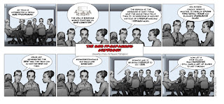

# Meeting is not just a meeting

*Published 2017-03-15*  
*Source: <https://visible-quality.blogspot.com/2017/03/meeting-is-not-just-meeting.html>*

---

We're sitting in a status / coordination meeting, and I know I don't look particularly happy to be there. The meeting, scheduled at 3pm has been lurking on my mind the whole day and for the last hour before it, I recognize I have actively avoided doing anything I really should be doing. And what I really should be doing is deep thinking while testing. I feel there must be something wrong with me for not being able to start when my insides are seeing the inevitable interruption looming.  
  
It's not just the inconvenient timing at the seeming end part of my day that has negative impacts on my focus. It's also the fact that I know the meeting is, in my perspective, useless and yet I'm forced there trying to mask most of my dislike. It drains my energy even further.  
  
In the ten years of looking at agile in practice, one of my main lessons has been that planning the work is not the work. I can plan to write a hundred blog posts, and yet I have not written any of them except for a title. I can plan to test, yet the plan never survives the contact with the real software that whispers and lures me into some cool bugs and information we were completely unaware of while planning.  
  
I love continuous planning, but that planning does not happen in workshops or meetings scheduled for planning. It happens as we are doing the work and learning. And sitting in a team room with insightful other software developers, any moment for planning is almost as good as any other. The unscheduled "meeting" over a whiteboard is less of an interruption than the one looming in my schedules.  
  
I know how I feel, and I've spent a fair deal of time understanding those feelings. I know how to mask those feelings too, to appear obedient and, as a project manager put it, "approach things practically". But the real practice for me is aspiring to be better, and to accommodate people with different feelings around same tasks.  
  
Planning is not doing the work. But it does create the same feeling of accomplishment. When you visualize the work, you start imagining the work is done. And if you happen to be a manager who sits through meetings day in and out, the disruptiveness of a meeting in schedule isn't as much as it is when you are doing the work.  
  
I used to be a tester. Then I became too good to test, and took the role of a manager. I was still good, just paying attention to different things. But the big learning for me came when I realized that to have self-organized teams as we introduced agile a decade ago in the organization, I was a hindrance. My usefulness as a manager stopped the people from doing the work I was doing. Stepping down and announcing the test manager role gone and just teaching all the work I had been doing to teams was the best choice I've done.  
  
And it made me a tester again. But this time around, I don't expect a manager to be there. I expect there's a little manager in every one of us, and the manager in others help me manage both the doer and the manager in me.  
  
The two roles were different for me. And awareness of that keeps me wary of meetings.  

