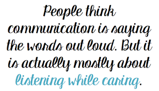

# Would You Just Listen for a Change?

*Published 2017-09-02*  
*Source: <https://visible-quality.blogspot.com/2017/09/would-you-just-listen-for-change.html>*

---

Six months ago, a new project manager walked in to our team planning meeting. It was loud, arguments were flying and there was a lot of laughter. The conclusion of our team dynamics was that we are like an Irish family. I think that was a compliment.

I absolutely adore my team. I love how the developers have embraced unit testing long ago, so that they do it automatically and seek new ideas on it. I love how the only reason stopping them from doing even better is invisible barriers of experiences of being punished or not supported. And I love how together, I truly feel we are more awesome. I feel at home when at work, I feel I get to be me. And that isn't true for all the places I've worked with.

There are some things that really leave me pondering though, and one of them in particular comes through my feeling of gendered reactions. These are not things where I'd even hint on discrimination. But they are more of things of structural nature, the expectations of how we are supposed to be. I can also argue they are not about gender, but about personality. It just happens that particular traits, while not only in a particular gender, seem to be more often assigned to a particular gender.

But, let's get to my two stories.

In June, I got a new team member. For the first week we worked together, I got him to pair with me (and my current team \*never\* pairs, we just talk), strong-style. We tested together, we both contributed, took turns on driving and navigating and did a better job testing our firewall together than neither of us would have done alone. He was 15-years old, and I was delighted to hear in the end of his summer job from other senior testers how much he had grown as a tester, in respect to how he had been earlier when doing training sessions with us. He is awesome, and pairing with me made his awesomeness develop into something really useful.

However, on week two I was less available, and he got to run with testing a feature of his own. The developers in the team took a different approach to testing than I did, giving him a step by step test case, instructions how to gather logs and evidence, and ended up guiding him into a bit of a mindless task he was not in full control of due to the appearance of detailed instructions.

His test results showed that there might be a problem. I tested sampling some of the same things, realizing the problem was in the instructions. But while I did this, a developer in my team took the first results (after I had said I will do a bit of a quality control task) and escalated the worrying results to high level managers.

He did not hear me say I believed there was a problem with the results.

He was delighted on how valuable results the summer intern had provided.

He did not intend to make me feel like my results are not equally valuable.

He did not realize that he has \*never\* escalated any of the stuff I find, even when there is a reason for doing just that.

He did not understand that he trusted a 15-year old intern two weeks into his first job ever more than someone with 23 years of hands-on testing experience.

He did not understand that no one has ever trusted me in the same way they trusted this 15-year old. On false results. I've fought every bit of important information visible. And I've become good at that. Fighting with a smile. But there's always the extra effort. I need to amplify my voice, myself. Luckily, good relations with the managers and a great track record in providing helpful information are all the amplification I usually need.

With this experience behind us, I put my team through a human experiment. In the name of team building I took us to an escape room, to collaborate. There was a detail I did not mention to my team: I had been there before. Which means this time, I had all the answers and I wasn't planning on giving them out, I was just there as a pair of hands and eyes leaving most of the puzzle for my team mates. My brain was free to monitor on how we worked together, and I was fascinated with what I learned.

I learned that when I gave a piece of information first creating certainty of attention (touch of a shoulder), I got listened to.

I learned that when I had information people did not want to accept, they completely dismissed me. I had to shout or do to be heard.

I learned I get heard best when I amplify something that comes from someone else.

I learned that even with information that should be easy to accept, I had to find the right person to give it to.

I learned they would take the credit.

I learned that I do need to put in the extra effort, but I get heard. The other woman in my team does not, without me amplifying her.

In a world where a 15-year old boy is a more trustworthy source than me, I find the problem is just the idea of listening and appreciating others inputs. And instead of teaching people what I have been taught (persistence, increase volume, find allies, use other people's voice when yours is dismissed) I just wish people would listen for a change.

I have my share of work to do on listening as well.

