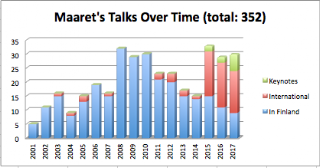
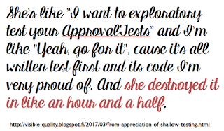

# Getting Through 2017

*Published 2018-01-01, updated 2018-12-26*  
*Source: <https://visible-quality.blogspot.com/2018/01/getting-through-2017.html>*

---

The year is about to change, and I want to continue my tradition of taking a moment of reflection before it's done. Living in the past (=being in USA) is handy, as it's already past midnight where I'm from and I still have a full working day for this. In case you're interested in comparison, this is what [my 2016 looked like](http://visible-quality.blogspot.com/2017/01/2016-what-year.html).  
  
My 2017 was rough on me. You might not have noticed, but I took significant pauses just to rest. The more I was around people in conferences, the more lonely I felt. So instead of looking at how much I did, I want to just think through progress I made, while struggling.  
  
**My work**  
  
I had my first full year back at F-Secure. I feel I'm home, but I also feel torn when I'm away. And I was away a lot. 21/30 sessions I delivered in 2017 were abroad.  
  
In 2017, I received some of the nicest, unintentional compliments from my colleagues at F-Secure. Some recognized how things were different when I was around. I worked to restore developers to the core of product decisions (No Product Owner experiment still ongoing), move the release decision power from testers (QEs as we call them) to the whole team and developers in particular, enabling fast fixing though frequent releases and knowing of the need through production monitoring.  
  
We got through a relevant major marketing release. I ended up holding space for steering group meetings for us to support each other in multi-team setting, and being invited as the R&D representative to a 360 business steering group for a wider area around products I'm testing. I got to reflect on my future career deciding to still not be a manager again, yet still having a relevant say in overall business decisions channeling voices of the developers in general.  
  
I also said it out loud: I'm done with my 3-year goal of being a keynote speaker. My next 3-year goal is to be a developer / architect by embracing the reinvigorated love I had since 15-years old on programming.  
  
I love my work. I want to spend more time at work. So 2018 will see less of me abroad.  
  
**Speaking**  
  
I did 30 sessions in 2017, and went through my stats of speaking sessions over the years since I started. I've now done 352 sessions (talks, workshops, courses) and all of these on the side of a full-time job.  
  
  
  
I've always held on to my work as "just a tester" - knowing that no one is ever just anything. I've reflected a lot more on why I keep speaking, and learned there's two things:  

- Meeting people to learn with - and the more "fame" I get, the less of this I get.
- Fueling my drive to improve at work to have stuff to speak on - the further I get on my improvements at work, the more "far-fetched" people feel the things I do are, even though they're not.

My talks got more personal. I enjoyed delivering "Making teams awesome" and "Learning through Osmosis" a lot. And I finally found a way to speak to developers about testing with "Breaking Illusions - Perspectives to Testing" that was just a very basic talk on what testing is and how everyone could improve on it. I also got a public reference on my abilities as a tester from a developer, listening to a podcast.  

  
**Other**  
  
While working and speaking, I also managed to do some other things.  
  
European Testing Conference 2017 got organized. European Testing Conference 2018 talk selection process taught me a lot with the chance to pair with [Franziska Sauerwein](https://twitter.com/singsalad) on our submitter Skype calls and meeting all the awesome people. I've taken a lot of joy introducing some of the awesomeness of the people who did not fit into the program to other people I know, and seeing new connections to create more great content happen.  
  
Women in Testing Slack group has been my support throughout the year. Having direct access to 150 women with similar interests and challenges have been invaluable. I love our #BragAndAppreciate channel, and the permission to say what we're doing without being considered negatively.  
  
My books progressed very little, but they did. Mob Programming Guidebook now has 741 readers with 201 paid (2016: 454/133), and Exploratory Testing book has 145 readers with 17 paid. What progressed is plans to make more room for writing in 2018. I still wrote 103 blog posts and kept to my idea of writing whenever inspired - as I write primarily for myself. I also wrote three articles, two of them with Ministry of Testing and one with Stickyminds. The latest one was just finished, so publishing will be on the 2018 side.  
  
Someone seems to read my blog, as I'm now at 490 628 hits (2016: 361622) on my posts. And people follow me on twitter, 3889 as of today (2016: 2964).  
  
While posting on twitter about #PayToSpeak conferences, I got called out for "misusing my influential stance". That was somewhat of an accomplishment, as I don't see myself as having influential stance, and if I have, it comes through doing work for stuff I believe in: testing, fair conferences, equity over equality and awesome software that makes a difference.  
  
**People**  
  
There's so many people I could mention that have impacted on the positives of 2017. So I just mention a few.  

- [Franziska Sauerwein](https://twitter.com/singsalad) joined organizers for European Testing Conference and has grown into a pair I do a shared talk with, and a friend I appreciate tremendously.
- [Selena Delesie](https://twitter.com/SelenaDelesie) was the friend who picked me up when I fell, reminding me that there can be a real connection with people you don't get to see or keep in touch all the time.
- [Jose Diaz](https://twitter.com/jdiaz_berlin) showed how deeply he thinks in the improving world of conferences, and helped me  love his Agile Testing Days even more than I did in the past.

The year saw birth of strong keynoting tester women: [Helena Jeret-Mae](https://twitter.com/HelenaJ_M?lang=en), [Ash Coleman](https://twitter.com/AshColeman30), [Alexandra Schladebeck](https://twitter.com/alex_schl), [Gwen  Diagram](https://twitter.com/gwendiagram),  [Nicola Sedgewick](https://twitter.com/nicolasedgwick), [Maria Kedemo](https://twitter.com/mariakedemo), [Ashley Hunsberger](https://twitter.com/aahunsberger), [Katrina Clokie](https://twitter.com/katrina_tester) and [Angie Jones](https://twitter.com/techgirl1908) are just few names I now remember to honor. You'd be lucky to have any of them speaking in conferences you participate. And there's more, just start with the list of [125 awesome testers](https://agiletestingdays.com/blog/125-awesome-testers-you-should-keep-your-eye-on-always/).

**My biggest lesson on 2017**  
  
There's a thing that I take out of my experiences in 2017 that is on the #PayToSpeak theme. I see from my stats why this is so important to me: I started speaking abroad only at a point where I had help on financing my travels, before that I was "stuck" in Finland for 14 years.  
  
The lessons for 2017 is the added respect for other aspects of organizing a conference that speakers thinking they are the product conferences sell don't see. Speakers don't sell tickets. Marketing sells tickets. And I admire people who are good at marketing, realizing that with my time limitations, I am not (yet).

***Signing out 2017 - always a tester, never just a tester.***
