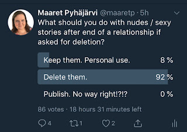

# Outing a Skeleton to Reclaim Control

*Published 2018-09-29, updated 2018-10-10*  
*Source: <https://visible-quality.blogspot.com/2018/09/outing-skeleton-to-reclaim-control.html>*

---

When I told a friend I had allowed a boyfriend to take nude images of me, they were visibly worried. They recounted stories of how it had turned bad, and I brushed it off without paying attention. I was an adult, in a committed consensual relationship that involved him traveling a lot. I took the chance to make someone I really cared for happy. And he was happy.  

He enforced more images and texts by being happy. By making me feel he appreciated me writing sex stories of our time together. But he also enforced this by messages of how hard being monogamous was for him, how important it was that he would be getting what he needed. And I did my share, writing over 50 stories.

As years passed, we grew apart, and I could no longer cope with the way he left me feeling: blackmailed, on the edge of receiving a call in the middle of the night of "following his heart". When I finally got that call I was afraid of all these years, I realized my fear had become a self-fulfilling prophecy. His heart had found someone new, and I was free of the nagging feeling this would happen one day. Like so many others, I realized we were never right for each other - our values were different.

With the change of status, the materials I had created for in-relationship entertainment became an issue. I asked him to delete it. He refused. I asked again, over and over. He refused.

For a few hours, I asked twitter until a friend contacted me to take the tweet down. She said it was hurting my professional image. It wasn't helping, my ex was not budging on the deletion. Like he said on his worst quality: "I'm right, a lot". He wasn't but he would remain stubborn.

For a month and a half, I have been trying to convince him without success. Instead, I've successfully turned the feeling of powerlessness into nightmares. With long consideration, I'm outing this skeleton in attempt to reclaim control.

In any sexual relationships between two adults, consent plays a role. I have expressed in so many words that he does not have my consent now or ever again to itemize me for his sexual pleasure. There's plenty of porn out there where consent is available, this material needs to be deleted.

I'm not comfortable with the risk of revenge porn even if I believe he would not do it intentionally. I'm not comfortable with him ever using me as an item for his pleasure, and he should know that from the fights that lead to us not being a couple.

My consent is mine to give, and mine to take away. He does not have it for use of this material.

I'm not comfortable with this material being a skeleton in my past, haunting my future. It exists. I've said it. But it only exists with him, and *only* because *he refuses to delete it*.

I would hope people who know [Llewellyn Falco](http://www.twitter.com/llewellynfalco) would manage to talk sense to him. I clearly don't manage to do so. His parents don't manage to do so at an adult age when he is right when he isn't.  
  
> ***UPDATE Oct-10th: Llewellyn confirmed he has deleted the materials. Thanks for support everyone.***

I've investigated my options legally, but unfortunately I'm not living in a country that has yet understood the idea of pre-emptive decisions on revenge porn. Existence of it threatens me professionally and privately much more than reclaiming my control to this information.

When I talk to someone like me, like my friends talked to me years ago I have a personal experience to share on why you should \*never\* create material like this. Love fades. And that kind of material, intended for the relationship, may not be part of the contract to clear when the relationship ends.

This material hurts women disproportionately.
