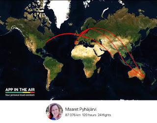
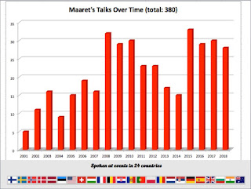

# Thank you 2018, what next?

*Published 2018-12-26*  
*Source: <https://visible-quality.blogspot.com/2018/12/thank-you-2018-what-next.html>*

---

The year is approaching its end, and I continue my tradition of cyclic reflection. Year cannot change unless I look back at what did I do, what are the big lessons I'm taking out of the experience and whether things are changing. I live my life letting myself do things I want to do, not things I plan to do. And enjoying what I do is my very public secret to getting done a thing or two.  
  
For continuity on my reflection, I looked at what [I wrote a year ago](https://visible-quality.blogspot.com/2018/01/getting-through-2017.html). Things look so very different with perspective and more understanding. I looked at 2017 as a difficult year feeling alone in conferences. I should see 2018 as a difficult year as it saw an end of a long term relationship, instead I see it as liberating me from the pains I was going through in 2017. Looking forward to seeing how things look yet another year into the future.  
  
**Conferences and Travel**  
  
To end last year, I decided:  
> "So 2018 will see less of me abroad."

That did not work out too well. Or in a way, it was clearly divided. I did a lot of travel on the first half of the year, not being able to cancel any of the existing commitments until I got to a point where I needed to clear the second half of the year seeing only one destination of travel.  
  

  
In ended up spending 120 hours on planes even with the 6 conferences I cancelled for later half of 2018. I was guilt-tripping on the "first yes then no" but looking at the new speakers and keynotes my cancellation helped enable, I can only be delighted and hope these conferences want to hear from me when my family life is better sorted out.  
  

  
  
Regardless of being off conferences, I seemed to compensate with local meetups, online webinars and paid trainings, ending up with 28 sessions delivered in 2018, totaling my public speaking now to 380 sessions since I started. I have always done these on the side of a full-time hands-on job, and find they bring great energy and balance.  
  
There are three particular highlights to 2018 for me. The talk I did with our 16-year-old intern at Nordic Testing Days was an effort to deliver, but showcased awesome growth as a tester and turning a 16-year-old into a public speaker in a conversational 2-person talk was lovely. Finding #MimmitKoodaa (Enabling women programmers in Finland) and teaching Java with them was another highlight.  
> This was by far the best training last spring!
>
> — Rauna Nerelli (@Nerelli) [October 2, 2018](https://twitter.com/Nerelli/status/1047167150878851080?ref_src=twsrc%5Etfw)

The third highlight was the invitation to teach again the Testing and Quality Assurance course at Aalto University.  
  
**Comparing Numbers**  

- 10/28 sessions were abroad (2017: 21/30)
- 110 blog posts (2017: 103)
- 572448 total hits on my blog (2017: 490 628)
- 4905 followers on twitter (2017: 3889)
- 1090 readers with 300 paid for Mob Programming Guidebook (2017: 741 with 201 paid)
- 336 readers with 73 paid for Exploratory Testing -book (2017: 145 with 17 paid)
- 201 collaboration calls with potential speakers for European Testing Conference (2017: 120 calls)

**Personal Branding**  
  
What I did in 2018 followed my energies, and it's been a little funny realizing how muddled my personal brand is. I have no control over what people know me for, and frankly I'm no longer sure I care.  
  
I'm a **development manager** (not a test manager), a hands-on **tester** and a **programmer**.  
  
I'm a **speaker** in topics of exploratory testing, pairing and mobbing, and agile.  
  
I'm a **mentor** and a **teacher**. I teach exploratory testing hands-on, and I mentor people on their general career but in particular on becoming speakers.  
  
I'm an **author** of this blog and now three books: Mob Programming Guidebook, Exploratory Testing and Strong-Style Pair Programming. All my books are work in progress and on LeanPub.  
  
I'm a **conference organizer** and **community facilitator**, organizing European Testing Conference and facilitating Software Testing Finland and Tech Excellence Finland and helping run [SpeakEasy](https://www.speaking-easy.com/) as one of the four leadership team members. I show up for Women in Testing Slack group (that grew from 150 to 350 members) and take time to promote the awesomeness around me.  
  
I'm a **social justice warrior**, a derogatory term I feel like owning up since it was used on me by a family member. I try to change things I can change, and not give up to be comfortable. My most common cause is [#PayToSpeak](http://paytospeak.org/) - the unfairness of having to have money to pay for travel to work for conferences and turning that dynamic around to enable diverse voices.  
  
**Looking Back**  
  
I did a lot and became more comfortable being me doing my things. I learned to appreciate that people can seem good and do a lot of damage and found some of my inner strength I had given away.  
  
Work at F-Secure is still wonderful. I became a development manager, and have spent my time since job crafting a manager job to look almost exactly like a tester job I used to have. I have some of the best colleagues, and look at how much we got done in our No Product Owner mode with delight. We enabled faster releases by more than just two people in the team, got our user numbers up to levels that feel intimidating as we started using the word "million", and found new ways of using statistics on both successes and failures to transform the ways we serve our user base.  
  
My kids do a lot better in school now that they have me more at home. And my home is full of love, with two 10+ year-olds being their own personalities.  
  
I made an impact on some people's speaking careers, and one person in particular made an impact on me: [Kristine Corbus](https://twitter.com/kriscorbus) showed me how anyone of us can choose to raise up the others, and how I'd rather model after someone like her.
