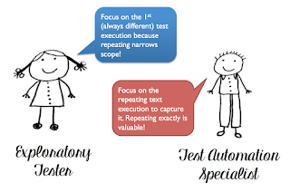

# Never Be Bored

*Published 2019-05-01, updated 2020-04-13*  
*Source: <https://visible-quality.blogspot.com/2019/05/never-be-bored.html>*

---

There are some personal guidelines that have served me well on my career with software testing and creation. While I teach **Be Lazy** to new programmers to avoid mistakes through allowing IDEs to do some of the basic lifting for them, my main thing to teach new testers is the idea of **Never be Bored**.  
  

  
Imagine a day at the office, testing the same software you've tested before. To get into the system, you need to log in. To get started with testing the functionality, you need some actions to set the state and data just right. You keep repeating the moves, if not every day, quite often. How could you not be bored?  
  
Let's face it. Repetition is boring. If you feel you're bored, it should be a trigger telling you that you're not doing what you could be doing. Never repeat exactly. Keep yourself awake, thinking of what could you vary.  
  
You need to log in. But why would you need to log in with the same user account every time? What if, just to spice things up, you'd create a new one? You need the state and data right for your test. What if, just today, you would create different set of data? What if you, just today, created a script to do this, and varied that script sometimes when you feel the need of doing something different? You need to get to the right functionality, and it requires these moves you need to do. But what if you did something before, something while getting there, and something after?  
  
Variables are everywhere, and the idea of Never Be Bored helps figure out when you get stuck in your ways, the steps through a minefield that minimize your chance of a lucky accident of finding something new.  
  
In the intersection of automation and exploratory testing, we approach the things that make us bored a little differently. Looking at things primarily as exploratory tester, not being bored means different paths as repeating narrows the coverage we can achieve overall. Looking at things primarily as test automation specialist, not being bored means that since there could and should be repetition, at least we don't personally have to be around for all of it. For great testing, we're intertwining these perspectives for a great balance.  
  

  
  
Having both perspectives intertwined works great on the Never Be Bored heuristic. It makes our work more versatile, and our results more relevant and sustainable.
