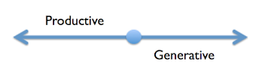

# From Individual Contributors to Collaborative Learners

*Published 2019-08-09*  
*Source: <https://visible-quality.blogspot.com/2019/08/from-individual-contributors-to.html>*

---

Look at any career ladder model out there, and you see some form of two tracks that run deep in our industry: the *individual contributors* and the managers.  
  
Managers are the people who amplify or enable other people. Individual contributors are the one who do the work of creating.  
  
The ideas of *needing* a manager run deep in our rhetorics. Someone needs to be responsible - like we all weren't. Someone needs to lead - like we all didn't. Someone needs to decide - like we all were not cut out for it. And my biggest pet peeve of all: Someone needs to ensure career growth - like our own careers were not things we own and work on. Like we needed a specially assigned role for that, instead of realizing that we learn well peer to peer as long as kindness and empathy are in place.  
  
For years, I was a tester not a manager. And this was important to me. And in my role as a feedback fairy, I came to realize that as an individual contributor, there was always a balance of two forms of value I would generate.  

With some of my actions, I was productive. I was performing tasks, that contributed directly to getting the work done. With some of my actions, I was generative. I was doing things that ended up making other people more productive.  
  
One of my favorite ways of contributing became *holding space for testing to happen*. Just a look at me, and some of my developer colleagues transformed into great testers. I loved testing (still do) and radiated the idea that spending time on testing was a worthwhile way of using one's time.  
  
As an individual contributor, I learned that:  
  

- My career was too valuable to be left on the whims of a random manager
- Managing up was necessary as an individual contributor so that random managers would be of help, not of hindrance
- Seeking inspiration from peers and sharing that inspiration helped us all grow further
- The manager was often the person least in position to enable me to learn

  
In most perspectives, it became irrelevant who was an individual contributor and who was a manager. The worst organizations were the ones that made an effort to keep those two separate by denying me work I needed to make the impact I was after as a tester because that work belonged to *manager*.  
  
  
Any of the impactful senior individual contributors were more of connected contributors - working with other folks to create systems that were too big for one person alone.  
  
As I grow in career age, I realize that the nature of software creation is not a series of tasks of execution but a sequence of learning. Learning isn't passed in handoffs, with a specialist doing their bit telling others to take it from there. Learning is something each and every one of us chipped away a layer at a time, and it takes time for things to sink in to an actionable level. Instead of individual contributors, we're collaborative learners.
