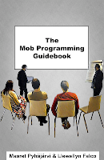
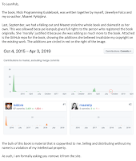

# A Man in Tech Doxed Me for a Copyright Dispute

*Published 2019-10-26, updated 2019-10-30*  
*Source: <https://visible-quality.blogspot.com/2019/10/a-man-in-tech-doxed-me-for-copyright.html>*

---

"I know where you live" is not anyone's wish for a message to receive. Worse yet, "You've been sloppy with sharing your private information" was not true. The private information that lead to the contact was not shared by me but by someone I started writing a book with and never finished before we went our separate ways.  

This is how I learned that Llewellyn Falco - a leading figure in the mob programming community - decided it was ok to publish my home address online without my knowledge or consent, leading people to my home by the mere choice of the place he published on.

This is what the online abuse community knows as doxing, even if this was a mild version of what could still happen. The person contacting me was a privacy enthusiast with no malicious intent making a point that I had been not careful, all the while I had been made vulnerable by someone with awareness that this was not my choice and would never be my choice.

As a result of this, I took the natural action:

- Requesting Llewellyn Falco to work to take down the information he had illegally posted. He has not responded. I would think both apology and action to correct would be in order.
- Requesting Llewellyn Falco's lawyer who had posted the info on his behalf to take down the information as registering private information of a European Union resident would not be GDPR-appropriate.
- Requesting the register holder Llewellyn Falco used to publish my home address to take down the information.
- Protecting myself by isolating myself from people silently supporting Llewellyn Falco leaving communities we were both part of and blocking our mutual followers on Twitter.

Out of communities we were both part of, I have taken steps back to Women in Agile who were quick to respond to the choice between the two of us and a small private community of programmers. I felt lucky to have Women in Testing and Makeupconf communities that would never have welcomed him in the first place and I could feel safe confiding in for advice and support.

If you are no longer seeing me in twitter, you may be one of the 150 people that I blocked. I will unblock with a message that you have made a choice of not following him. I will regularly rerun the blocking script for people who are following him.

**Why Would He Do Such a Thing?**

While I feel hurt and offended, I can bring myself to imagine that doxing me was not his *intent* but it was his *impact*. Just like with so many other cases we witness around bad actors, they don't mean to hurt when they do. The reason he does this is a copyright dispute.

Normally people would resolve copyright issues in a court of law and I have welcomed him to invite me there. He chose to take a path of harassment.

Back in the days, we started writing a book together under the idea of open source. We published early versions on LeanPub. The dispute, as I understand it, comes from our difference in understanding what open source means in the context of us creating a book together for a while and separating as authors before the book is finished.

I take the perspective that we co-created text that is available openly for both of us to use forward. My name is not available for him to use forward when we part ways.

He takes the perspective that last published copy on LeanPub ends the project and blocks both of us from continuing on the unfinished work.

LeanPub, as a platform says nothing of the copyright. So I agree we don't agree and might need to resolve it. That is where court could be helpful should he feel he needs to change status quo.

I deduct his intent from his actions:

- April 3rd he disputed contents on LeanPub using Github to claim text we had pair written (physically, I had written) on his computer was written by him and that I would think adding to text I had already written was removing his copyright. In fact I recognized his contribution inside the book but continued using my text to finish an unfinished book on LeanPub placeholder that was always mine but I had invited him as a contributor. He needed to ask to take it down because the project was mine and he was a second author while working with me. The book cover has my name first, the LeanPub page was held by me - it was my project and he was a contributor for a while.

  

- April 4th LeanPub made final call blocking the LeanPub book and all books I could write with Mob Programming on the title.  Deducting intent, I call out intent to harm me. Removing me from my marketing platform in attempts to alienate me from the mob programming community for his personal gain.
- On April 6th I rebooted my mob programming guidebook completely, writing every single word of ideas I had gone through writing before again. This is why my book is available with [https://mobprogrammingguidebook.xyz](https://mobprogrammingguidebook.xyz/). It is not the same book, it is my fork of the book we never finished, with significant effort used to remove any of the stuff where I disagreed with what I wrote in the first place as compromise to two person co-creation effort. The book is still under construction.
- On April 7th I learned that an unauthorized private copy of book we had previously distributed on LeanPub was on Github posted by Llewellyn. I hold copyright as the first author, my name is on the cover. I requested to take it down as copyright owners we had only agreed LeanPub as publication place and he had effectively removed that from both of us through a GitHub issue to the project he published it in. He never responded.
- On April 30th, his lawyer registered a US copyright for both of us for book that misrepresents the book he hosts on github presenting him as the first author. I was not made aware of the copyright registration at all. The book was written in Finland and I am the first author. He knew to protect his personal information while disclosing mine.
- On October 23rd a privacy advocate uses the information from the copyright registration where he publishes my home address to contact me on my sloppiness on handling my personal data.

**The Personal**

All of the above is very much business as usual, and even business. However, in my call for action, I want to add the personal.

Yes, we used to date.

It did not end pretty.

I had to ask Set Enterprises Inc under GDPR with a threat of fine to remove nudes and sexy stories I had given him while in relationship. He wanted to withhold those. I won and I'm eternally grateful to EU legislation and the mediators in the community a year ago failing to influence him then.

There was no way our professional collaboration could continue.

**My Call for Action**

If you read all of this, I have a request for you and you may choose to dismiss it. I had not asked to renounce him with any of the previous actions, but doxing my home address knowing what that means to a social justice oriented woman in tech, he crossed every single one of my boundaries.

I would ask you to choose me to be part of your communities but that means that:

- If you follow him, I block you. We can't co-exist.
- If he is welcome as "ally" in your women in ... groups, I will not be welcome as a woman in your women in... group.
- If he is welcome in an online slack/group, I will not be. I leave quietly,
- If he is welcome in your conference as speaker, I will not be welcome in the same conference. I will leave as soon as I recognize he is there and facilitate your convenience through creating a speaker rider that states we cannot co-exist.

I wish you would kick him out as he encouraged kicking out "simpleprogrammer" a week ago, deplatforming him but I feel I am not in the place to call for that action. I wish the people would choose to include me by excluding him, but I recognize that since his bad behavior is more private of nature, he can keep his fake ally status and alienate me from the mob programming community I have also in my own right contributed.

Communities are nothing more than connections of people, and it is my own choice to step to the side for safety.

This is how women in tech leave. Thanking the people who are there for them, fading into invisible.  
  
*Edit 30.10.2019. Let me make this clear: I have done already my part of running blocking scripts and scheduling reruns of it. The only thing to do is change how things are by asking for unblock, conditioned on not following him. This is my equivalent of stepping out of the space he is in.*
