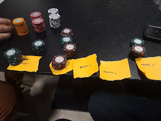
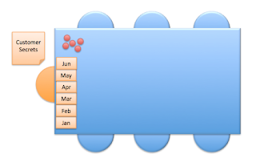

# Business Value Game - What if You Believed Value is Defined by Customer, Delivery-time?

*Published 2020-02-10, updated 2020-02-11*  
*Source: <https://visible-quality.blogspot.com/2020/02/business-value-game-what-if-you.html>*

---

Over the years of watching projects unfold, I've grown uneasy with the difficulty of understanding that while we can ask the customer what they want in advance, we really know the value they experience after we have already delivered. All too often "agile" has ended up meaning we optimize for being busy and doing something, anything, and find it difficult to focus on learning about the value. To teach this through experiences, I've been creating a business value game to move focus on learning on value.  
  
We played this game at European Testing Conference, and it reminded me that even I forget how to run the game after some months of not doing it. Better write about it then!  
  

*[Crystal Mbanefo](https://twitter.com/CrystalMbanefo) took a picture of us playing at European Testing Conference.*

**The Game Setup**  
  
You need:  
  

- 5 colors of token, 25 tokens each color
- "Customer secrets" - value rules for the customers eyes only where some value is

- Positive
- Negative
- Changes for the color
- Depends on another color

- Precalculated "project max budget" that is the best value team can achieve learning the rules of how customer values things
- Placeholders for each month of value delivered on the table
- Timer to run multiple rounds of 3 minutes - 6 months - projects and reflection / redesign time, total 60-90 minutes. 30 seconds is a month, reflected by the placeholders on the table.

More specific setup:

- Create 5 batches of "work", each batch with 5 tokens of each of the 5 colors
- Place post-its in front of where customer is sitting so that work can be delivered
- Hand "customer secrets" to customer and allow them to clarify with you how their value calculation rules work
- Post "project max budget" on a whiteboard as reference
- Explain rules:

- 6 people will need to do the work
- The work is flipping a chip around with left hand
- The work is passed forward in batches, starting batch size is 25
- After one finishes the work, the other can start
- Only value at customer is paid for, and customer is available at the end of the 6-month project to announce and make the payment.

  

  
**First round:**  

Usually on the first round, the focus is on the work and trying to get as much of it done under the given constraints as possible. With large batch size moving through the system, it takes a long time before the team starts delivering.  Usual conclusion: smaller batch size.

During retrospective, we identify what they can and cannot change:

- They cannot pre-arrange the chips, the work can only start when project starts.
- They can ask the customer to be available for announcing and making payments earlier. Monthly payments are easy to ask for.
- They can do the work of 6 flips in any order, but the all 6 people doing the work must be involved in each work item before it is acceptable for the customer.
- They can do smaller batches and order chips in any order they want - after the project has started.
- They can use only one hand, but do not need to limit themselves to left hand only.

**Second round:**

  
Different groups seem to take batch size idea in different scale on round 2. While batch size of 1 would seem smart and obvious, a lot of teams bring things down to batch size 5 first. It does not really matter, with both smaller batch sizes what usually happens on round 2 is that the team delivers with lot of energy, and all chips end up on the customer side. The customer is overwhelmed with saying how much anything is worth, so even if the team agreed on a monthly payment, customer is able to announce the value of the month only towards end of the project. With focus on delivery, if customer manages to announce the value, the team does not listen to react.  
  
At the end, team gets smaller than the maximum value, regardless of their hard focused work. We introduce the concept of importance of learning, and how that takes time in the project.  
  
During retrospective, they can identify the ways of working they agree to as a team to change the dynamic. Here I see a lot of variance in rules. Usually batch size is down, but teams struggle to control how the batches get delivered to customer or listen to the customer feedback. Often a single point of control gets created, and a lot of the workers stay idle while one is doing thinking.  
  
**Third-Fourth-Fifth rounds:**  
  
Depending on the team, we run more projects to allow experimenting with rules that work. We let the customer secrets stay the same, so each "project" fails to be unique but is yet another 6 months of doing the work with same value rules. Many teams fail at creating learning process, only a learning outcome for the rules at hand.  
  
**Final round:**  
  
On last round, customer can create new values for value and the team tests their process whether they are able to now learn during the project.  
  
**The hard parts: facilitation and the right secrets**  
  
I'm still finalizing the game design, and creating better rules for myself to facilitate this. A key part that I seem to struggle with still is the right values for "customer secrets". The negative values need to be large enough for the team to realize they are losing value by delivering things that take away the value, and the dependent and changing values can't be too complex for the customer to be able to do the math.  
  
I've usually used values in multitudes of 100 000 euros because large numbers sound great, but less zeros would make customers life easier.  
  
I play with poker chips because they have a nice heavy feel for "work" but since carrying around 10kg of poker chips isn't exactly travel friendly, I also have created impromptu chips from 5 colors of post-it notes.  
  
Also, still optimizing the process myself on how to combine delivering and learning. There is more than one way to set this stuff up.  
  
Let me know if you play this, would love to hear your experiences.
