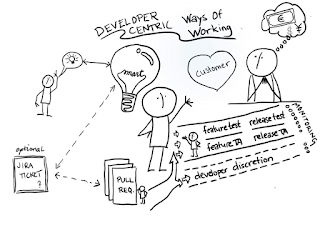

# Developer-centric way of working with three flight levels

*Published 2020-04-07*  
*Source: <https://visible-quality.blogspot.com/2020/04/developer-centric-way-of-working-with.html>*

---

The way we have been working for the last years can best be described as a developer-centric way of working.  
  
Where other people draw processes as filters from customer idea to the development machinery, the way I illustrate our process is like I have always illustrated exploratory testing - putting the main actor in the center. With the main actor, good things either become reality or they fail doing so.  

In the center of software development is two people:

- the customer willing to pay for whatever value the software is creating for them
- the developer turning ideas into code

Without code, the software isn't providing value. Without good ideas of value, we are likely to miss the mark for the customer.

Even with developers in the center, they are not alone. There's other developers, and other roles: testers, ux, managers, sales, support, just to mention a few. But with the developer, the idea either gets turned into code and moved through a release machinery (also code), and only through making changes to what we already have something new can be done with our software.

As I describe our way of working, I often focus on the idea of having *no product owner*. We have product experts and specialists crunching through data of a versatile customer base, but given those numbers, the product owner isn't deciding what is the next feature to implement. The data drives the team to make those decisions. At Brewing Agile -conference, I realized there was another way of modeling our approach that would benefit people trying to understand what we do and how we get it done: flight levels.

Flight levels is an idea that when describing our (agile) process, we need to address it from three perspectives:

1. Doing the work - the team level perspective, often a focus in how we describe agile team working and finding the ways to work together
2. Getting the work coordinated - the cross team level of getting things done in scale larger than a single team
3. Leading the business - the level where we define why the organization exists and what value it exists to create and turn into positive finances

As I say "no product owner", I have previously explained all of this dynamic in the level of the team doing the work, leaving out the two other levels. But I have come to realize that the two other levels are perhaps more insightful than the first.

For getting work coordinated, we build a network from every single team member to other people in the organization. When I recognize a colleague is often transmitting messages from another development team in test automation, I recognize they fill that hole and I serve my team focusing on another connection. We share what connections give us, and I think of this as "going fishing and bringing the fish home". The fluency and trust in not having to be part of all conversations but tapping into a distributed conversation model is the engine that enables a lot of what we achieve.

For leading the business, we listen to our company high level management and our business metrics, comparing to telemetry we can create from the product. Even if the mechanism is more of broadcast and verify, than co-create, we seem to think of the management as a group serving an important purpose of guiding the frame in which we all work for a shared goal. This third level is like connecting networks serving different purposes.

The three levels in place, implicitly, enabled us to be more successful than others around us. Not just the sense of ownership and excellence of skills, but the system that supports it and is quite different from what you might usually expect to see.
