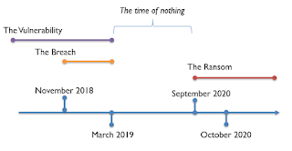

# The Vuln, the Breach and the Ransom

*Published 2020-10-27*  
*Source: <https://visible-quality.blogspot.com/2020/10/the-vuln-breach-and-ransom.html>*

---

A week ago, I was reading the news in Finland to learn that a major psychotherapy service provider, Vastaamo, had received a ransom note from someone in possession with their patient database. I could guess I would soon find myself a victim, and a few days later on Thursday, that's exactly what I was told. The event unfolded some more when on Saturday I, like apparently tens of thousands of others, received a marketing-style personalized ransom email asking me to pay.

I'm lucky - whatever discussions I have had there have already seen the social media and just filing in a crime report on the ransom was a no-brainer.

My first reaction was to be upset with Vastaamo for doing a crappy job protecting our information, as the criminal's messages implied that the reason they had the information was that the database was left online, with root:root access credentials. An open door, yes, but not an excuse for stealing something private, and even less of an excuse to blackmail folks.

My fascination for this case comes from being a professional tester. With the 25 years of working, I have been a part of reporting and getting fixed hundreds, most likely thousands of vulnerabilities. Even the problem of weak password for relevant data in production, there's been more of that than I care to count. There's been protecting admin interfaces by thinking a secret address that we only know would protect it. There's been great plans of security controls, that turn out to be just plans but not turned reality. Well planned is not half done, it isn't even started.

Bad protection shouldn't happen, and I would love to say you need folks like myself, aware of the issues around security and keen to follow through to practice to not leak through something this stupid. I even made the claim that this is level of protection for \*health records\* is against the law as I filed that complaint last Thursday on Vastaamo. But bad protection happens, and all it takes is, like the now-fired-ceo of Vastaamo claims, a human error. And perhaps, deprioritizing work that would cover at least the basics of security controls.

As time passes and news unfolds, my focus turned on my annoyance on how the news reports on when the company knows their data was stolen.

We need to separate, on a timeline, a few concepts.

- **The Vulnerability** is the open or insufficiently locked door
- **The Breach** is the moment someone walked through that door
- **The Ransom** is the moment when they used the data illegally in their possession for further steps

  
Separating these three, we can collect statements of what we know.

- The vulnerability was fixed in March 2019 and this is how they know data after that haven't leaked (for this particular incident)
- You can't fix a thing you don't know is broken. So they know of the vulnerability even if they don't know of the breach.
- The ransom requests were reported to police in September 2019 and this is how we know when the company knew they had been breached for a fact.
- The breach could have happened any time the vulnerability was there and we have been given two points of when the data was accessed. We are told the latter is something the company figured out in their security audit activities (which lead to fixing the vulnerability). We don't know if the company knew of November 2018 breach before the ransom request.

The timeline of these will become very important for the CEO of Vastaamo, as the new owner is interested in whether they were sold a company knowing the breach. But knowing a vulnerability is not knowing a breach. They are separate and we just don't know yet.

With the hundreds or thousands of vulnerabilities I have been part of, the number where I am aware of a breach is less than one hands fingers. Sometimes we don't know because knowing requires going back and analyzing. Sometimes we don't have the data to analyze, but more often we end up looking into future. Similarly, with the hundreds or thousands of vulnerabilities,  I can still cope with my fingers on calculating how many times we have told we had a vulnerability that we fixed to our customers.

We find vulnerabilities through analysis and testing.

We learn of breaches through logs monitoring use and contacts.

We tell of vulnerabilities to customers when we have identified they were almost certainly breached, and most certainly now protected.

We fix vulnerabilities in secret to not invite more breaches.

I don't like that the news are passing such one-sided perspective on an upcoming court case on the Vastaamo CEO that will define timing of the vuln, the breach and the ransom. Knowing one is not knowing the other.
