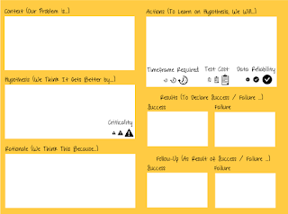
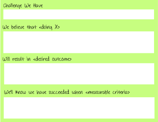
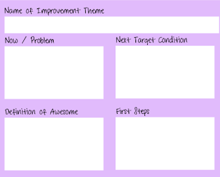

# Canvassing for improvement experiments with a canvas

*Published 2020-11-13*  
*Source: <https://visible-quality.blogspot.com/2020/11/canvassing-for-improvement-experiments.html>*

---

If all the world is open to you, why do things like they were always done? Throughout my career, I have held one heuristic above all others for exploratory testing:

> Never be bored.

Obviously, I have been bored. But I have never accepted it as a given, or a thing I cannot change with internal locus of control. I can't change the world around me (always), but I can change how I look at the world. And I choose to look at it with creativity and playfulness, and being just enough of a rebel that things can be different.

With enough rehearsing on ideation on both how I would test and how I would frame the system I test in (not software system, the system of people in organizations), I've collected ideas that I can combine into new. I find myself being one of those people who show up to a retrospective with ideas of what we could try, and with increasing comfortability in the idea that to learn the most, we should have half of our ideas be too far off so that they should fail, and other half take us further through successes.

I'm quite happy with some of the experiments that stuck with us. The "no product owner". The "vanishing backlogs". The "start from automation". The "zero bug policy". The "wait for pull". The "stop reporting bugs". The "rotating responsibility". The "power of network". I could go on listing things personal, team and organization, and notice how much more I enjoy telling the stories of successes. Let's try X could become a personal mantra.

This week, I decided to experiment on how I share my experiments. I'd love to see people propose ideas from left and right, but while that isn't happening, I can model that through what I do. I wanted a visual describing what change goes on with me. The visual - a improvement experiment canvas - is a tool for canvassing - seeking support, asking people for opinions on things that are easily invisible.

I ended up creating this:

Improvement Experiment Canvas

I fill it in using Mural, but also have a pdf version I already passed forward for people without the tool.

The fields explain themselves well enough, but the little icons don't. Criticality is about how important this hypothesis is for our success. Timeframe required is about time required for the experiment, from days to weeks to months. Test cost is about how much effort doing it will take. Data reliability is about generalizability of results.

No product owner experiment was months, and we could not do all the follow-up learning in days or weeks. It didn't take us any extra effort, just a mind switch. Data reliability in the organization was anecdotal, and we did not need it to be more.

I also consider two other templates. A very straightforward one:

  

And one based on Toyota Kata, where focus is more on themes rather than individual experiments.

  

  

The first two experiments I described this week. One of them is duration of a few weeks, from start to finish of a feature. Another is one month, to see if a major change in how we track our work feels good or not. Defer commitment. Defer scale. First learn. And learn continuously.
