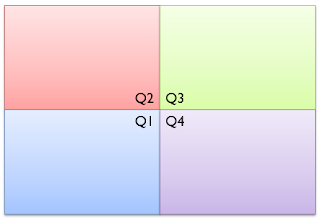
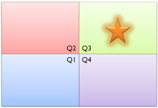
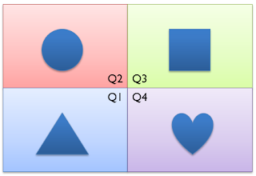
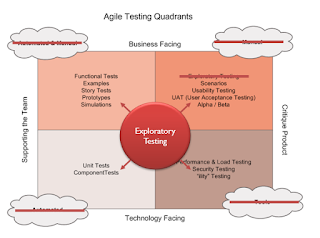

# The dynamics of quadrants models

*Published 2021-04-16*  
*Source: <https://visible-quality.blogspot.com/2021/04/the-dynamics-of-quadrants-models.html>*

---

If you sat through a set of business management classes, chances are you've heard your teacher joke about quadrants being \*the\* model. I didn't get the joke back then, but it is kind of hilarious now how the humankind puts everything in two dimensions and works on everything based on that.

The quadrants popularized for Gartner in market research are famous enough to hold the title ["magic"](https://en.wikipedia.org/wiki/Magic_Quadrant) and have their own Wikipedia page.

Some of my favorite ways to talk about management like Kim Scott's Radical Candor are founded on a quadrants model.

The field of testing - Agile Testing in particular - has created it's own popular quadrant model, the [Agile Testing Quadrants](https://lisacrispin.com/2011/11/08/using-the-agile-testing-quadrants/).

Here's the thing: I believe agile testing quadrants is a particularly bad model. It's created by great people but it gives me grief:

- It does not fit into either of the two canonical quadrant model types of "move up and right" or "balance".
- It misplaces exploratory testing in a significant way

Actually, it is that simple.

**The Canonical Quadrant Models**

It's like DIY of quadrants. All you need is two dimensions that you want to illustrate. For each dimension, you need some descriptive labels for opposite ends like hot - cold and technology - business. See what I did there? I just placed technology and business into opposing ends in a world where they are merging for those who are successful. Selecting the dimension is a work of art - how can we drive a division into two that would be helpful, and for quadrants, in two dimensions?

  

  

The rest is history. Now we can categorize everything into a neat box. Which takes us to our second level of canonical quadrant models - **what they communicate**.

You get to choose between two things your model communicates. It's either *Move Up and Right* or *Balance*.

Move Up and Right is the canonical model of Magic Quadrants, as well as Kim Scott's Radical Candor.  Who would not want to be high on *Completeness of Vision* and *Ability to Execute* when it comes to positioning your product in a market, or move towards *Challenging Directly* while *Caring Personally* to apply Radical Candor. The Move Up and Right is the canonical format that sets a path on two most important dimensions.

Move Up and Right says you want to be in Q3. It communicates that you move forward and you move up - a proper aspirational message.   

The second canonical model for quadrants is *Balance*. This format communicates a balanced classification. For quadrants, each area is of same size and importance. Forgetting one, or focusing too much on another would be BAD(tm).

  

Each area would have things that are different in two dimensions of choice. But even when they are different, the *Balance* is what matters.

**Fixing Agile Testing Quadrants**

We discussed earlier that I have two problems with agile testing quadrants. It isn't a real model of balance and it misrepresents exploratory testing. What would fixing it look like then?

For support of your imagination, I made the corrections on top of the model itself.

  

First, the corner clouds must go. Calling Q1 things like unit tests automated when they are handcrafted pieces of art is an abomination. They document the developer's intent, and there is no way a computer can pull out the developer's intent. Calling Q3 things manual is equally off in a world where we look at what exactly our users are doing with automated data collection in production. Calling Q4 things tools is equally off, as it's automated performance benchmarking and security monitoring are everyday activities. That leaves the Q2 that was muddled with a mix already. Let's just drop the clouds and get our feet on the ground.

Second, let's place exploratory testing where it always has been. Either it's not in the picture (like in most organizations calling themselves Agile these days) or if it is in the picture, it is right in the middle of it all. It's an approach that drives how we design and execute tests in a learning loop.

That still leaves the problem of *Balance* which comes down to choosing the dimensions. Do these dimensions create a balance to guide our strategies? I would suggest not.

I leave the better dimensions as a challenge for you, dear reader. What two dimensions would bring in "magic" to transforming your organizations testing efforts?
