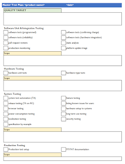
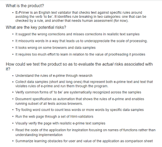

# The Power of Three Plans

*Published 2021-09-10*  
*Source: <https://visible-quality.blogspot.com/2021/09/the-power-of-three-plans.html>*

---

This week, I have taken the inspiration from discussions at FroGSConf last week, and worked on my test plans. And today, I am ready to share that instead of creating one plan, I created three - I call this the power of three. Very often different things will serve you best for what you are trying to plan for, and for the things I wanted, I couldn't do with one.

**The 1A4 Master Test Plan**

The first plan I created was a master test plan. Where I work, we have this fairly elaborate template from the times when projects were large and not done in an agile fashion. That plan format overemphasized thinking of details prematurely, but has good ideas behind it, like understanding the relationship of different kinds of testing we will or will not do.

Analyzing it, I could condense the relevant part of the plans into one A4 with many things that are specific to the fact that we are building embedded systems.

While I don't think I wrote down anything so insightful into the plan that I could not share the actual plan I created for my project, I opt on the safer side. We did not tick some of these boxes, and with this one-glimpse plan we could see which we did not tick, and had conversation on one of them we should be ticking even if we didn't plan to.

You can see my plan format has five segments:

- **Quality Target** describes the general ideas about the product that drive our idea of how we think around quality for this product.
- **Software Unit & Integration Testing** describes the developer-oriented quality practices we choose from generally.
- **Hardware Testing** addresses the fact that there is a significant overlap and dependency we should have conversations on between hardware and system testing.
- **System Testing** looks at integrated features running on realistic hardware, becoming incrementally more complete in agile projects.
- **Production Testing** addresses the perspectives of hardware being individuals with particular failure modes, and something in assembly of a system, we have customer-specific perspectives to have conversations on.

For us, different people do these different tests but good testing is done through better relationships between the groups, and establishing trust across quality practices. The conversations leading up to a plan have taken me months, and the plan serves more as a document of what I facilitate than a guideline of how different people will end up dealing with their interdependent responsibilities.

We could talk about how I came up with the boxes to tick - through workshops of concepts people have in the company and creating structure into the many opinions. A visual workshop wins over writing a plan but we could talk about those in another post later.

**The System Test Strategy**

The second plan I created was inspired by the fact that we are struggling with focus. We have a lot of detail, and while I am seeing a structure within the detail, I did not like my attempts of how I wrote it down before. On the course I teach for [Exploratory Testing Academy](https://www.exploratorytestingacademy.com), I have created a super straightforward way of doing a strategy by answering three questions and I posted a sample strategy from the course on twitter.

I realized I had not written one like this for the project I work in, and got to work and answered those questions. This particular one I even shared with my team, and while I only got comments from one, at their perception was that it was shining light on important risks and reactions in testing.

In hindsight, my motivation for writing this was two fold. I was thinking of what I would say to the new tester on the ideas that guide our testing as they start in a week, and I was thinking what would help me in pruning out the actions that aren't supporting us in a tight schedule we have ahead of us.

This plan is actually useful to me in targeting the testing I do, and it might help with *some* in-team conversations. I accept that no document or written text ever clears it all, but it can serve as an anchor for some group learning.

**The Test Environments Plan**

The third plan I produced is a plan of hardware and connections into test environments. If there is one thing that does not move very agile fashion, it is that of getting hardware. And I am not worried of the hardware we build ourselves, but on the mere fact that we ordered 12 mini-PCs off the self type in May, and we expect currently to receive them in December. There's many things in this space that if you don't design in advance, you won't have when you need it. The hardware and systems are particularly tricky in my team with embedded software, since we each have our own environment, we have many shared environments and some environments we want to ensure have little to no need of rebooting to run particular kinds of tests on.

So I planned the environments. I drew two conceptual schematics of end-to-end environments with necessary connections, separated purposes to different environments, addressed the fact that these environments are for a team of 16 people in my immediate vicinity, and for hundreds of us over the end to end scenario.

It was not the first time I planned environments, and the main aspects I did this week on this plan is ensuring we have what we need for new hires and new features coming in Fall '21, and that we would have better capabilities in helping project discuss cost and schedule implications to not having some of what we would need.

**The Combination**

So I have three plans:

- The 1A4 master test plan
- The system test strategy
- The test environment plan

For now I think this is what I can work with. And it is sufficient to combine them into just links to each of the three. Smaller chunks are more digestible, and the audiences differ. The first is for everyone testing for a subsystem. The second is for system testing in the subsystem, in integration with other subsystems. The third is for the subsystem to be reused by the other teams this subsystem integrates with.

I don't expect I need to update any of these plans every agile iteration we do, but the ideas will evolve while they might stand the test of time for next six months. We will see.
