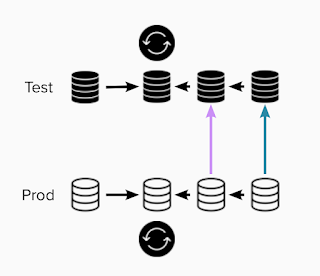

# Lessons Learned on Working with Data-Intensive Applications

*Published 2021-10-29*  
*Source: <https://visible-quality.blogspot.com/2021/10/lessons-learned-on-working-with-data.html>*

---

In my years of teaching test design techniques, I have come to teach people that there are (at least) two essentially different types of functionalities we design tests for:

- **function-intensive** applications are ones where you list the tricks the app can do, and a lot the work in designing tests are creating lists of functionalities and exploring when they work.
- **data-intensive** applications  are ones where the same functionality is riddled with data-oriented rules, and you are collecting business rules captured in data.

This difference became clear to me as I switched jobs long time ago from antivirus software development (function-intensive) to pension insurance (data-intensive), and spent the next few years trying to wrap my head around the new challenges I had not paid attention to before.

When data became the center of my testing universe, I learned that one of the major challenges we would be spending a significant chunk of our time on would be picking the "test data". If we needed a person who was just about to turn 63 (age of early pension), and we wanted to test today the scenario that they were under the limit and tomorrow the scenario that they were over the limit, we needed to find a precise set of data with those conditions.

And the data was not simple and straightforward row in a database. It was a connected set of databases, some owned by our company, some by some other companies, and for getting a production like experience in test environment, we had tools to choose someone and pull all related information into our systems. Similarly, we know we had an agreement that with 14 days notice, the other pension insurance field players would set their data on request to match what their production had. When I knew who pulls one data set and scrambles the data in the process and who pulls entire copies of their production databases and scrambles the piece we use to match the way we scramble, I could help our testing by the business experts flow a lot nicer.

10 years passes, and I forgot it was difficult because for me it was routine. Until today when I had to explain it in my current place of work why it is that something so easy and obvious to me is so difficult and complex to many others.

This is what we had today. An application hooked into its own database. A separate production and test environment. But connected business application data between production and test environments.

  

Some applications make it preventively hard to use artificial data in test environments. When your business systems run tens or hundreds of hourly synch batch jobs, have tens or hundreds of users executing their day-to-day manual processing tasks on the user interfaces and the system clock that inevitably changes things because you have time-based logic, you will need to replenish the data from production.

What we had was two different very simple replenish cycles. Once a month on an agreed date, one of the systems would get a refreshed copy from production. Once a year, another of the systems would get a refreshed copy from production.

I had designed last year our test data, independent of production in the other parts of the end to end test environment to be ok when data moves like this. The two systems synchronizing had the necessary data in production, and would be reintroduced with replenishing the data.

Except it did not work.

The application had bugs around not expecting the data to be replenished, but only on the logic that changes once a year.

Someone else had not understood the rule of how to set up the data and had requested data that vanished in the replenish.

I spent significant time teaching how to follow the data across the systems, and how the logic works between connected data sources and different environments. If I did not know this, I could not have tested the functionalities (data-intensive ones) last year when I did.

What I learned though is that:

- documenting and knowledge sharing does not help if there is 10 months between being taught and needing the information
- what I consider clear may be unclear to others
- everything that can fail will fail, but at least it failed in test environment
