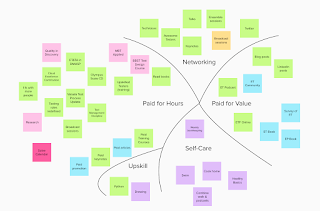

# Reflections on a Cadence

*Published 2021-12-28, updated 2022-01-01*  
*Source: <https://visible-quality.blogspot.com/2021/12/reflections-on-cadence.html>*

---

When last year was ending, I remember the distinct feeling of now wanting to move as I had before with my end of year reflections. Instead of looking back on yet another year, I wanted to look forward. So instead of writing a summarizing blog post, I thought about what I might want to find my balance on, and came up with this.

  

I identified five areas of focus to seek balance: *paid for hours, paid for value, networking, up skill and self-care*. I did many of the things, but some of the things I had plans for turned out less successful.

Let's summarize the numbers:

- 47 external talks, with 30 different topics/titles
- 58 blog posts, 3 #TalksTurnedArticles and 1 full course turned text on dev.to
- 16 rackets recorded with Ru
- a regular 7,5 hrs a day job doing details I can take inspiration from but not detail
- someone created a [wikipedia page of me](https://fi.wikipedia.org/wiki/Maaret_Pyhäjärvi)
- 4 times [Tester of the Day](https://2021.testeroftheday.com)

This totals my talks to 474 since I started public speaking in 2001, and my blog posts to 784 with total of 783,567 page views and my twitter follower number to 7835. That means two years has added me 152 560 page views on my blog and 2173 followers on my twitter. With my blog and twitter being more of public notetaking than writing to an audience, I still find it amazing that some people find value in what I write on.

Overall, the year at work was amazing. Did good stuff with good people.

Instead of reflecting on all of this and feeling overwhelmed, I want to write down some of my failures.

- I committed to contributing to "cloud center of excellence" and "company-wide process improvement", only to learn that I hated it. The ideas of finding common denominators for essentially different teams and needs felt like I was not doing anyone a favor, and I walked out of the effort. Being true to how I felt was more important that struggling with work I was not cut out for.
- I struggled with exerting energy with people I felt disconnected with regularly. If I did not have my home group of many awesome people around the organization, I would have found myself completely depleted. Tried to fix that by introducing a change and trying a different group, different approach, different challenges.
- I failed to notice someone was not speaking to me or listening to me until it blew up 3 months later when I said something they needed to listen to.
- I decided to do measuring, and did some, gave up on most of it as there's enough trouble to measure the physical world, I can rethink measuring the invisible in software later.
- I avoided writing my books by writing tons of talks and articles. Productive procrastination, but procrastination all the same.
- I did not learn to draw, but I learned to test better (again, and still more to do), and I did learn much on python.
- I did not learn to communicate without insulting the other party in search of change, and probably never will. The "extending use of pytest to system testing" feel much more dishonest than "removing Robot Framework" even though they essentially mean the same thing and the latter causes multiple people to actively attack me even though I am still only seeking improving efficiency and effectiveness of our testing.
- I replaced all other ideas of "self-care" with lots of hugs, deep conversations with my teens and digging a hole for myself on not doing bookkeeping in time but finding family come to rescue when I need them.

Every year I learn about what I can do and can't do. I make choices on accepting some, and changing some. I get many things right, and many things wrong. But I total on the positive.

Because I don't have to go to office, I have more time in my hands. I'm healthier on old dimensions, since I have always been allergic to people with animals, and there's plenty of those at the office. I'm still connected with people who matter to me, and physical location isn't what determines my best connections outside my immediate family.

We built something relevant at work, and I leave things better than they were when I found them. My new place finds use for me, and has lovely group of people, and all this leaving and joining fits the storyline we've built for me. I'm happy that I dare to try things that don't always work out, and step out when that is the right thing to do.

Doing many small things continuously gets you through a lot. So while I can't explain it all of work here, I will get to reflect that - on a cadence - next.
