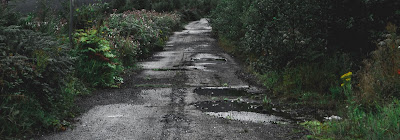

# Software Maintenance

*Published 2022-01-28*  
*Source: <https://visible-quality.blogspot.com/2022/01/software-maintenance.html>*

---

This winter in Finland has not been kind to our roads. I got to thinking of this sitting on the passenger seat of a car, slowly moving on a ice covered bumpy road, with potholes in the ice left from the piles of snow that did not get cleared out when weather was changing again. The good thing about those potholes are that they are temporary in the sense that given another change of weather, they get either filled or the ice melts. Meanwhile, driving is an act of risking your car.

Similar phenomenon, of a more permanent type without actions, happens for the very same weather reasons, creating potholes in the roads. Impact for the user is the same, driving is an act of risking your car. Without maintenance, things will only get worse.

This lead me into thinking about software maintenance and testing. Testing is about knowing what roads need attending to. Some roads are built weak and need immediate maintenance. Others will degrade over time under conditions. Software does not keep running without maintenance any more than our roads can be safely driven on without maintenance.

Similarly, we have two approaches to knowing roads could use maintenance and testing of software:

- automation: have someone drive through the road and identify what to fix out of a selected types of things that could be off
- thinking: recognize conditions that increase risk  of selected types of things or could introduce new categories of problems we'd recognize when we see it but may have trouble explaining

Knowing you need maintenance is start of that maintenance. And having the machinery to drive through every road is an effort in itself, and we will be balancing the two.

We care about knowing. But as much as we care about knowing, we care about acting on the knowledge more.
