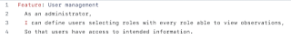
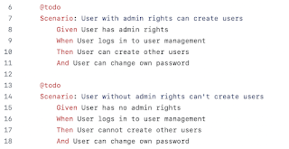
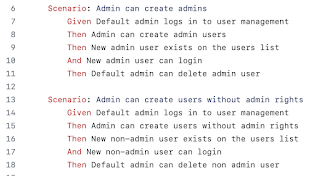
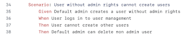
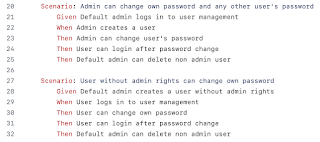
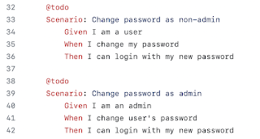
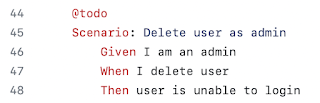
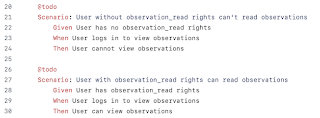
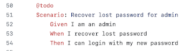

# Language change in Gherkin Experiment

*Published 2022-07-28*  
*Source: <https://visible-quality.blogspot.com/2022/07/language-change-in-gherkin-experiment.html>*

---

I find myself a Gherkin (the language often associated with BDD) sceptic. The idea that makes other people giddy with joy on writing gherkin scenarios instead of manual tests makes me feel despair, as I was never writing the manual tests. The more I think about it and look at it, the more clear it is that the Gherkin examples when done well are examples rather than tests, and some of the test case thinking is causing us trouble.

What we seek with Gherkin and BDD is primarily a conversation of clarity with the customer and business. When different, business-relevant examples illustrate the scenarios our software needs to work through, the language of the user is essential.

In our experiment of concise-but-code tests vs gherkin-on-top tests, I find myself still heavily favouring concise-but-code.

def test\_admin\_can\_delete\_users(

assigned\_user: User, users\_page\_logged\_in\_as\_admin: UsersPage, users\_page: UsersPage

) -> None:

users\_page\_logged\_in\_as\_admin.create\_new\_user(assigned\_user.name, assigned\_user.password)

users\_page.delete\_user(assigned\_user.name)

I'm certain that the current state of fixtures has some cleaning up to do, but I can have a conversation also with this style in user's language. Before implementing, we talk in Friends format *the one where admins can delete all users including themselves* and after implementing, we have the format turned into something where just the name of the test(s) and main steps need to be occasionally looked at together.

It is clear though this is not a format in which the users/business would already be writing our tests for us, and currently I am in a team where we have a product owner who would love nothing more than to be able to do that. There is also a sense of security for external customers if we could share them the specs that we test against that makes considering something like Gherkin worthwhile.

In this post, I want to look at the [user/business collaboration created Gherkin](https://gist.github.com/maaretp/2e789f210d553b4542b238f3990d4321) for this feature in our project compared to the [result that is running in our pipeline](https://gist.github.com/maaretp/34b7fff26560f73c6f2aac2f5839f6f1) today. Luckily, the feature we are experimenting is so commonplace that we reveal absolutely nothing of our system by sharing the examples.

The user/business collaboration generated examples started with two on creating new users:   

**From: old**

These turned to three by now.

**From: new**

  

You can see a difference in language. Earlier we talked about users, where some of them get admin rights and others don't. Now, the language emphasis is on having admin and user. Also the new language isn't yet consistent on these, having admin and admin user used interchangeably in the steps. The new language also reveals a concept of default admin, which just happens to be one user's information on the database when it starts - clearly something where we should have a better conversation than the one I was around to document with the user/business collaboration session.

The second one of the new also threw me off now that I compare it. I first reacted on admin's not being able to create users without admin rights - there is no admin without rights, those are the same thing. But then I realized that the it is trying to say *Admin can create users that are not admins.*

Another thing that this sampling makes obvious is that two scenarios turned to three, and the split to creating admins and users makes sense more for a testing point of view than business point of view. Again, admin is just a user with admin rights. Any user could be an admin, permanently or temporarily.

Similarly, it turned longer. Extra steps - deleting in particular - was introduced as step to each. Clearly a testing step made visible, and adding most likely not the essential part of the example for user/business.

And it also turned shorter. Changing password, the essential functionality originally described vanished and found a new home, simplifying this scenario as it was also separately described in the original.

**From: new**

**From: old**

With this one, steps exist for testing purpose only. They now describe the implementation. A common pitfall, and one we most definitely fell into: not illustrating the requirement as concisely as we could, but illustrating operating of the system as test steps.

Interestingly, after the first example and mapping the original and the new, we have six things that originate with user/business, and only one that remains in the implemented side.

**From: new**

  

We can find the match from the originals to this one.

From: new

  

So what else got lost in translation? These three.

  

From: new

The first two are the real reason why such functionality exists in the first place, and it is telling that those are missing. They require testing two applications together, a "system test" so to speak.

The last one missing is also interesting. It's one that we can only do manually editing the database after no admin access, again a "system test".

Having looked at these, my takeaways are:

1. Gherkin fooled us in losing business information while feeling like it was "easier" and "more straightforward". The value of reading the end result is not same as value of reading the business input.
2. Tests will be created on testing terms and creating an appearance of connection with business isn't yet a connection
3. The conversation mattered, the automated examples didn't.
