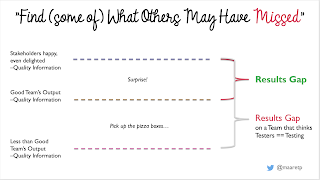

# The Result Gap - Describe the Invisible

*Published 2022-08-18*  
*Source: <https://visible-quality.blogspot.com/2022/08/the-result-gap-describe-invisible.html>*

---

At work, and at a planning meeting. The product owner asks about status of a thing we're working on in the team. It's done, and tested, exclaims the developer. It's done, tested by you but not tested by me, correct the tester.

This repeats with small word variations all the time. Sometimes it's the eyeroll that says your testing may not be all the testing. Sometimes it is words. Sometimes it is the silence.

But it is hard to explain to people how it is possible that testing is done but testing is not done. What is this funny business here?

I started modeling this after one particularly frustrating planning meeting like that. I can explain the gap between testing and testing as the seven functional problems we still needed to correct, and the one completely lost test environment and another completely lost mailsink service that blocked verifying things work. Of the seven functional issues on three minor features one of the issues was that one feature would not work at all in the customer environment, the famous "works on my machine" for the development environment.

While the conversation of testing being done while testing isn't done is frustrating, describing the difference as the results gap can work. There's the level we really need to have on knowing and working before we bother our customers, and there's the level developers in my great team tend to hit. It is generally pretty good. When they say they tested, they really did. It just left behind a gap.

I call this type of results gap one of "Surprise!" nature. We are all surprised about how weird things can we miss, and how versatile the ways of software failing can be. We add things with each surprise to our automation tests, yet there seems to be always new ways things can fail. But the surprise nature says these are new ways it fails.

  

The top gap is what I expect a developer with a testing emphasis to bring in an agile team. Catch surprises. Make sure they and the team spend enough time and focus to close the results gap. It's a gap we close together over time by learning, but it also may be a gap where learning new things continually is needed. I have yet to meet a team where their best effort to make me useless really made me useless.

There is another possible meaning for the results gap, and this type of results gap makes me sad. I call this "Pick up the pizza boxes..." results gap. In some teams, the developer with a testing emphasis is tasked to create mechanisms to notice repeating errors. A little like assuming all kids who eat pizza leave the boxes in living room floor and you either automate the reminder making it just right so that kids will react to it and take out the garbage, or you go tell that with your authoritative voice while smiling. Some people and teams think this is what testers are supposed to do - be developers clean up reminding service.

When working in teams with pizza box results gap, it is hard to ever get to the levels of excellency. You may see all the energy going into managing the bug list of hundreds or thousands that we expect to leave lying around, and half your energy goes into just categorising which piles of garbage we should and should not mention.

This sad level I see often in teams where management has decided testing is for testers and developers just do unit testing - if even that. The developers are rewarded in fast changes, and fixing those changes is invisible in the ways we account for work.

What does it look like then in teams where we are minimising the results gap?

It looks like we are on schedule, or ahead of schedule.

It looks like we are not inviting developers to continuously do on-call work because their latest changes broke something their automations were not yet attending to.

It looks like we pair, ensemble, collaborate and learn loads as a team. It look like the developer with testing emphasis is doing exploratory testing documenting with automation, or like I now think of it: all manual testing gets done while preparing the automated testing. It might be that 99% of time is prep, and if prep is too little, your developer with testing emphasis may simplify the world joining the rest of the ream on good team's output level information and no one attends to the results gap on top but the customer.

Do you know which category of a results gap your team is working on, and how much of a gap there is? Describe the invisible.
