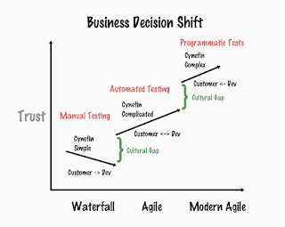
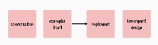

# The Three Cultures

*Published 2023-01-02*  
*Source: <https://visible-quality.blogspot.com/2023/01/the-three-cultures.html>*

---

Over the last 25 years, I have been dropped to a lot of projects and organizations. While I gave up on *consulting* early on and deemed it unsuited for my aspirations, I have been a tester with an entrepreneurial attitude - a consultant / mentor / coach even within the team I deliver as part of.

Being dropped to a lot of projects and organizations, I have come to accept that two are rarely the same. Sometimes the drop feels like time travel to past. Rarely it feels like time travel to future. I find myself often brought in to help with some sort of trouble, or if there was no trouble, I can surely create some like with a past employer where we experimented with no product owner. There was trouble, we just did not recognise it without breaking away from some of our strong-held assumptions.

I have come to categorize the culture, the essential belief systems around testing to three stages:

1. *Manual testing* is the label I use for organizations predominantly stuck in test case creation. They may even automate some of those test cases, usually with the idea speeding up regression testing, but majority of what they do relies on the idea that testing is predominantly without automation, for various reasons. Exploratory testing is something done on top of everything else.
2. *Automated testing* is the label I use for organizations predominantly stuck in spearing manual and automated testing. Automated testing is protected from manual testing (because it includes so much of its own kind of manual testing), and the groups doing automation are usually specialists in test automation space. The core of automated testing is user interfaces and mostly integrated systems, something a user would use. Exploratory testing is something for the manual testers.
3. *Programmatic tests* is the label I use for whole team test efforts that center automation as a way of capturing developer intent, user intent and past intent. Exploratory testing is what drives the understanding of intent.

The way we talk, and our foundational beliefs in these three different cultures just don't align.

These cultures don't map just to testing, but the overall ideas of how we organize for software development. For the first, we test because we can't trust. For the middle, we test because we are supposed to. For the last, we test because not testing threatens value and developer happiness.

Just like testing shifts, other things shift too. The kind of problems we solve. The power of business decisions. Testing (in the large) as part of business decisions. The labels we use for our processes in explaining those to the world.

This weekend I watched an old talk from Agile India, by Fred George on 'Programmer Anarchy'. I would not be comfortable taking things to anarchy, but there there is a definite shift in where the decision power is held, with everyone caring for business success in programmer-centric ways of working.

The gaps are where we need essentially new cultures and beliefs accepted. Working right now with the rightmost cultural gap, the ideas of emergent design are harder to achieve than programmed tests.

Documentation is an output and should be created at times we know the best. Programmed tests are a great way of doing living documentation that, used responsibly, gives us a green on our past intent in the scope we care to document it.
