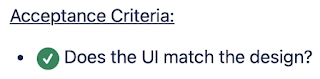

# The Documentation Conundrum

*Published 2023-05-18*  
*Source: <https://visible-quality.blogspot.com/2023/05/the-documentation-conundrum.html>*

---

Writing things down is not hard. My piles of notebooks are a testament to that - I write things down. The act of writing is important to me. It is how I recall things. It is how I turn something abstract like an idea into something I can see in my minds eye on a physical location. It frees my capacity from the idea of having to remember. Yet it is a complete illusion.

I don't read most of the stuff I write down. I rarely need to go back to read what I wrote. And if I read what I wrote, it probably would make less sense than I thought in the moment, and would incur a huge cost in reading effort.

Yet, the world of software is riddled with the idea of writing things down and expecting that people would read them. We put new hires through the wringer of throwing them at hundreds of pages of partially outdated text and expect this early investment into bad documentation to save us from having to explain the same things as new people join. Yet the reality is that most of the things we wrote down, we would be better off deleting.

We think that writing once means reading in scale, and it might be true for a blog post. To write once in a form that is worth reading in scale either takes a lot of effort from the writer or happens to touch something that is serendipitously useful. Technical documentation should not be serendipitously useful, but it should be worth reading, in the future that is not here yet. It should help much more than hinder. It should be concise and to the point.

Over the course of a year, I have been on an experiment on writing down acceptance criteria. I set the experiment with a few thoughts:

- product owner should not write the acceptance criteria, they should review and accept the acceptance criteria - writing is more powerful clarification tool than reading, and we need most power to clearing mistakes where they end up in code
- acceptance criteria is output of having developed and delivered - we start writing them as we have conversations, but they are ready when the feature is ready and I will hold together discipline of writing down the best knowledge as output
- question format for accepting / rejecting feels powerful and is also something that annoys both the people above me in org charts who would choose "shall" requirements format and a product owner believed it was important to change format, thus we will
- acceptance criteria exist on epic level that matches a feature, smallest thing we found worth delivering and mentioning - it's bigger than books recommend but what is possible today drives what we do today

So for a year, I was doing the moves. I tried coaching another tester into writing acceptance criteria, someone who was used to getting requirements ready and they escaped back to projects where they weren't expected to pay attention to discovering agreements towards acceptance but it was someone else's job. I tried getting developers to write some, but came to the notion of collecting from conversations being a less painful route. I learned that my best effort in writing acceptance criteria before starting feature was 80% of the acceptance criteria I would have discovered by being done with a feature, fairly consistently. And I noted that I felt very much like I was the only one, through my testing activities, who hit uncertainties of what our criteria had been and what it needed to be to deliver well. I used the epics as anchors for testing of new value, and left behind 139 green ticks.

  

Part of my practice was to also collect 'The NO list' of acceptance criteria that someone expected to be true that we left out of scope. With the practice, I learned that what was out of scope was more relevant to clarify, and would come back as questions much more than what was in scope. 18 of the items on 'The NO list' ended up being incrementally addressed, leaving 40 still as valid as ever on time of my one-year check.

For a whole year, no one cared for these lists. Yesterday, a new tester-in-training asked for documentation on scope and ended up first surprised that this documentation existed as apparently I was the only one fully aware of it it the team. They also appeared a little concerned on the epics incremental nature and possibility that it was not all valid anymore, so I took a few hours to put a year of them on one page.

The acceptance criteria and 'the NO list' created a document the tool estimates takes 12 minutes to read. I read them all, to note they were all still valid, 139 green ticks. 'The NO list' items, 58 of them had 31% to remove as we had since added those in scope.

The upcoming weeks and conversations show if the year's work on my part to be disciplined for this experiment is useful to anyone else. As artifact, it is not relevant to me - I remember every single thing now having written it down and using it for a year.  But 12 minutes reading time could be worth the investment even for a reader.

On the other hand, I have my second project with 5000 traditional test cases written down, estimating 11 days of reading if I ever wanted to get through them, just to read once.

We need some serious revisiting on how we invest in our writing and reading, and some extra honesty and critical thinking in audiences we write to.

You yourself are a worthwhile audience too.
