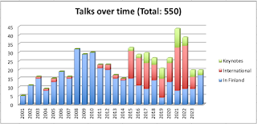

# You are enough

*Published 2024-11-30*  
*Source: <https://visible-quality.blogspot.com/2024/11/you-are-enough.html>*

---

Sometimes there is just too much going on. Too many self-volunteered tasks and deadlines, some more visible than others. And you find yourself doing a lot. Feeling in control though, you chuck through the pile recognizing there is no progress if you juggle the load, filled with anxiety. Finding that sense of agency, you do what is in your power to do. That sense of power, it is essential.

I come to think of this for multiple triggers in this space in the last weeks:

- Firehosing information
- Exercising replan
- Managing anxiety in others

With the four stories to share, I ground myself to the purpose I have blog in the first place. Not to write the perfect articles. But to write down things to reflect. Usefulness of my reflections to others remains with the  discretion of the reader. It's different to what majority of bloggers do, but then again, not everyone frames their blog as 'seasoned tester's crystal ball'.

**Firehosing information**

I know a thing or two. I learn more by building a foundation of what I know by sharing it, and have built a bit of an identity in reflection and proving myself wrong. I take pride in the 180 turns of opinions I can recognize on my work. The attitude towards whether continuous integration is a good idea. The idea of what test cases should look like. The idea about separation of concerns to developers and testers. The attitude towards automation. I have written evidence that I learned and changed views. It used to scare me enough to not say things of today. But I learned that I am enough today, even when I am not enough as today for tomorrow.

I have needed to tap into this lesson a lot now that I have a lot of new colleagues, with a lot of those learnings I have needed to lead myself through over the years. I have needed to remember that I did not change my perspective because I was told what was right. I changed my perspective because I observed myself the options, and had agency in making those changes to my internal model of the world.

I have a lot to say. And I moderate on how much of it I say. I have decided now that I say one piece from stage a month with audience of my colleagues and anyone in the Finnish community, through the platform that Software Testing Finland (Ohjelmistotestaus ry) offers. And I hold space for conversations with my colleagues on leading and managing testing twice a month. Once a day I can post on our internal channel to share something. Once a day I can post on LinkedIn to share something. And on Mastodon / Bluesky, I can say what I want to say when I want to say it.

I write and say more in a week than others can consume. Sharing is an outlet, and a processing method.

November was a month of firehosing. I did seven new talks. One because of my choices of cadence, but 6 others because someone pulled and asked for them. Doing my tally of stage presence a month early was an act of offloading.

It's been hard to remember that the one guy giving me feedback last year everything I ever say is shit, and the other guy giving me feedback this year that "quantity is not quality", just in case I did not already deal with enough negative internal self-talk, they aren't the full picture. I am enough. You are enough. It is true for us all, without comparison to others.   

**Exercising replan**

While my head needs an outlet of information through sharing, the visible parts of what I do aren't all I do. Life has been a lot, work has been a lot.

I found myself in a situation where I had so many competing tasks to complete that I couldn't.

I couldn't deliver a report to a customer that I promised. So I told the customer, and took a week of extra time. Turns out the appreciated the confession of a consultant overestimating the pace in which they can analyze a complex situation.

I could not find time to talk to half a dozen people about test automation I wanted to. I didn't, and while they may not forgive me, I forgave myself by letting them know what I learned while I could not show up for them.

I have still one more thing on replanning, and I am balancing the cost of replanning on that one. Me doing it might just be easier than me replanning it for someone else, we've already been through two bounces back to me.

Ending up with too much requires replan. Requires confessing need of help, need of time and space, and support. Remembering I am enough even when I am not enough for all the things I may end up with.

**Managing anxiety in others**

Being a leader is about having people who follow you, sometimes with positional power but sometimes just because they were in search of someone with ideas. I still call myself a regretful manager, because I don't want to manage; I don't want to lead. I would much prefer if we shared the leadership and the doing, and found ourselves negotiating our journey together.

I have bubbles that recharge me where the world is peer to peer. Our group of regretful managers. My monthly benchmarks on work with a peer, now running for multiple years. I love these groups.

But I also have other groups where I show up to hold space. Even in volunteering side, I find I volunteer to manage. Set context for decisions, while trying to stick to my own boundaries of what I can take on. And making space with spoons to ease anxiety of others. Reminding them they are enough, because while I can tell that to myself and believe it, some people need to hear it from me.

With these stories, I would remind you: you are enough. You have agency. You have outlets - writing, talking from stage, talking to people. And just because it's not easy or even possible, it's not you.

**You are enough.**
