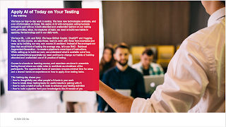
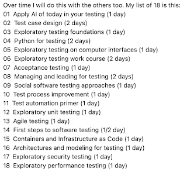
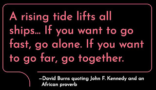

# A Six Month Review

*Published 2024-12-05*  
*Source: <https://visible-quality.blogspot.com/2024/12/a-six-month-review.html>*

---

That time of the year when you do reflections is at hand. It's not the end of year yet, even if that is close. But a few relevant events in cadence of reflections culminated yesterday and today, leading me to writing for a seasoned tester's crystal ball.

The three relevant events are all worth a small celebration:

- Yesterday was first day **after trial period at CGI** as Director specializing in testing services and AI in application testing. We are both still very happy with each other. I should say it more clearly - I love the work CGI built for me, and I love that I get to bring in more people to do that work with me also next year. CGI's value-based positioning as an organization that supports volunteering and great community of testing professionals (testers, developers, product owners and managers/directors throughout the organization showing up for testing) has been a treat.
- Today the **TiVi ICT 100 Most Influential**list was published just for Finnish Independence Day, and I found my name on the list for 6th year in a row. You can imagine there are more than 100 brilliant professionals influencing in the ICT in Finland, and Finland has had a good reputation of educated ICT professionals with internationally competitive prices meaning that for a small country, we have a lot of brilliant people in ICT. Representing testing on this list even with title 'Director', is a recognition for all the great people teaching each other continuously in the community. Testing belongs.
- Today we received **positive news of one frame agreement bid** I had been contributing to in my 6 months at CGI. Building a series of successes in continuing as a partner of choice with me around brings me joy.

While these things are the triggers of reflection today, it is also a good time to take a look at themes of testing coming my way.

**Distributing Future Evenly**

When searching for work with a purpose, I welcomed the opportunity to put together themes of relevance*:*

- **Impact at Scale**. I believe we need to find ways of moving many of our projects to better places for quality and productivity. Many organizations share similar problems and there has to be ways of creating common improvement roadmaps, stepping plans to get through the changes, and seeing software development (including testing) with increased successes. Scale means across organizations, but also over time when people change.
- **Software of Relevance**. I wanted to work on software that I feel connection with. I have been awarded multiple customers with purposes of relevance and feel grateful for the opportunities.

Turns out this is a combination of conversations internally with people I work with, our current and potential customers, and the testers community at large.

I have met over 150 peers at CGI in 1-on-1 settings (I tracked statistics for first four months and reacting 160, I decided counting something else would make sense). I have enjoyed showing up with our internal Testing Community of Practice in Finland, and started to create those internal connections globally. I have learned to love the networked communication expectation where hierarchy plays a small role. I've done monthly sessions for external testing community of practice Ohjelmistotestaus ry with broadcast of topics I work on. And I have been invited to conversations with many clients.

**AI in Application Testing**

With testing as my backdrop living up to a reputation of 'walking testing dictionary', there is a big change into the future we have with increased abilities in automation with AI helping with quality and productivity.

I have looked at tens of tools with AI in them. For unit testing, for test automation programming, and for any and all tasks in the space of testing. From exploring these tools, I conclude a need of seeing through the vocabulary to make smart choices. With models as a service, it's what we build around those models that matter. The technical guardrails for filtering inputs and outputs. The logic of optimizing flows. The integrations that intertwine AI to where we are already working.

In these 6 months, I created a course I teach with Tivia ry - 'Apply AI of Today on Your Testing'. Tivia sets up public classroom versions, and both they and CGI directly are happy to set up organization specific ones.

  

The things that I personally find exciting in this space in the last six months are:

- Hosted models. Setting up possibility to have models on your own servers (ahem, personal computers too) so that I can let go of modeling what my data tell about me or reveals from my work.
- Open source progress. Be it Hercules for agents turning Gherkin to test results, or any of the many libraries in the Selenium ecosystem showing proofs of concepts on what integrations are like, those are invaluable.
- Customer Zero access. Having CGI be a **product company** allows us to apply things. Combine the motivation and means, and I have learned a lot. And yes, CGI has a lot of products. Including CGI NAVI, which is software development artifact generation product.

**Digital Legacy**

The time focusing on scaling testing has warranted me revisiting my digital legacy. From being able to create AI-Maaret by having 20 years of my thinking on written formats, to making choices of how I would  increase the access to my materials for everyone's benefit has been a continuous theme.

From 50 labels of courses in Software Testing, I brought things down to only 18.

Should testing expertise be a capability you are building, we could help with that. We're currently prioritizing which of these we teach for CGI testing professionals next year. In addition to all the other training material we already have had without my digital legacy.

Purpose-wise, I am now moving from having access to this myself to institutionalizing the access. And that means changing license for next generations of this from CC-BY to CC-BY-NC-SA, and you could always purchase licenses that allow other uses too.

**Collaboration and Sharing**

With tentacles in the network towards all kinds of parties, I still facilitate collaboration. My personal vision is frame a lot of work with open sharing, this being my current favored quote.

  

The tide is something we create together. And we want to go far. Sharing openly is a platform for that collaboration so you see me sharing on [Linkedin](https://linkedin.com/in/maaret), [Mastodon](https://www.mas.to/@maaretp) and now also [Bluesky](https://bsky.app/profile/maaretp.bsky.social). My DMs on these are open.

**Networking**

With open DMs and email (maaret.pyhajarvi (at) cgi . com), I am available for conversations. I have targets set on networking and should you have a thing we can discuss for seeking mutual benefits, don't be a stranger and get in touch.

I am open to showing up in events, but I am still not proposing talks in CfPs. Please pull if I can help, and I help where I can.

I show up for Tivia ry to take forward the agenda of Software in Finland. I show up for Ohjelmistotestaus ry to build a cross-company platform on testing. I show up for Mimmit Koodaa in any way I can, because that program is the best thing we've had for many many years. And I show up for Selenium, as volunteer in the Selenium Project Leadership Committee. I show up for FroGSConf open space as participant because it is brilliant. I show up for private benchmarking, currently with three groups of seasoned, brilliant professionals driving a global change in testing through supporting one another.

As new thing, I have discovered "Johtoryhmä", women in ICT leadership in Finland. Will show up for that too.

And when we meet, please talk to me. I am still socially awkward extrovert who imagines people don't  automatically want to talk to me. You talking to me helps me. And our conversations may help us both.
