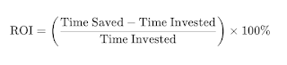
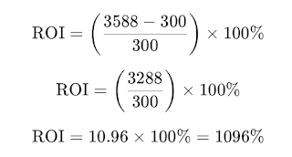
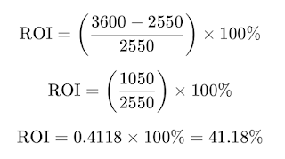

# Purposeful and realistic return on investment calculations

*Published 2024-12-19*  
*Source: <https://visible-quality.blogspot.com/2024/12/purposeful-and-realistic-return-on.html>*

---

It's a time of the year that allows us all an excuse to message people we usually don't. I had a group like that in mind: managers of all of my tester colleagues at work. There's two reasons why I usually don't message them:

1. We coexist in the same pool as peers, but we have no official connection
2. There is no list of them easily accessible

You can't create a connection with your peers without being intentional about it. Having now tracked through coverage of fellow customer contact people (200+ by now), I needed a new dimension to track. This is just one of them, although an important one.

Yet still, you can't contact them if you don't know who they are. With large number of test professionals, asking around won't work. And the manual approach of tracking through organization chart is probably a lot of work, even when the data is available.

For six months, I have accepted that such list does not exist. Call it holiday spirit or something, but that response was no longer acceptable to me. So I set out to explore what the answer is.

Writing a script can be one of those infamous "10 minute tasks", but for purposes of discussing return on investment, let's say it takes 300 minutes. Maybe it is because originally I wanted to create a list of test professionals and automatically update it to our email list because I hate excluding new joiners, but since I am exploring, I never forgot what I set out to do, but I may have ended up with more than I had in mind at first. I take pride in my brand of discipline, which is optimizing for results and learning, not to a commitment made at a time when I knew the least -- anything past this moment in time.

So, I invested 300 minutes to replace 299 minutes of manual work. Now with that investment, I am able to create my two lists (test professionals and their managers) investing 1 minute of attention on running the script (and entering 2FA response). How much time is this saving, really?

I could say I would run this script now monthly, because that is the cadence of people joining. Honestly though, quarterly updates are much more likely because of realities of the world. I will work with the optimistic schedule though, because 12x299 is so much more than 4x299. Purposeful return on investment calculations for the win!

You may have done this too. You take the formula:

You enter in your values and do the math (obvs. with a tool that creates you a perfect illustration to screenshot).

  

And there you have it. 1096% return on investment, it was so worth it.

The managers got their electronic Christmas card. I got their attention to congratulate them on being caretakers of brilliant group of professionals. I could sneak in whatever message I had in mind. Comparing cost and savings like this, purposeful investment calculations, its such a cheap trick.

It does not really address the value. I may feel the value of 300 minutes today, but is there a real repeat value? It remains to be seen.

That is not all that we purposefully do with our investment calculation stories. I also failed to introduce you to the three things I did not do.

1. **Automating authentication**. 2FA is mean. So I left it manual. Within this week we have been looking at 2FA on two Macs where automating it works on one and not on other. I was not ready to explore that rabbit hole right now. Without it, the script is manual even if it runs with 1 minute attended and 15 minutes unattended.
2. **Automating triggering it with a pipeline**. It's on my machine. It needs me to start it. While pushing the code to a repo would give access to others, telling them about it is another thing. And while it works on my machine, explaining how to make it work on their machine given the differences of machines and knowledge levels of the relevant people, this should really be just running on a cadence.
3. **Maintainability**. While this all makes sense to me today, I am not certain the future me will appreciate how I left things. No readme. Decent structure. Self-documenting choices of selectors, mostly. But a mental list of things I would do better if I was to leave this behind. I would be dishonest saying this is what I mean as work when I set out to leave automation behind.

When you factor all of that in, there is probably a day or a week of work more. Week because I have no access to pipelines for these kinds of things, and no one can estimate how quickly I will navigate through the necessary relationship building to find a budget (because cloud costs money), gain access and the sort.

The extra day brings my ROI to 380%. A week extra brings me to:

Now that's a realistic return on investment calculation, even if it still misses the idea that this would could be not done, not repeated if it was not valuable. And the jury is still out on that.

This story is, most definitely, inspired by facing the balance of purposeful and realistic often for work. And I commit to realistic. Matter of fact, I am creating myself a better approach to realistic, because automation is great but false expectations just set us out to failure.
