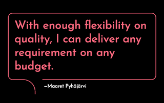

# Socializing requirements

*Published 2025-01-02*  
*Source: <https://visible-quality.blogspot.com/2025/01/socializing-requirements.html>*

---

There's an article making rounds in the Finnish software communities about the greatness of low code platforms. As the story goes, a public servant learned to create a system he had domain expertise in on the side of his job, and the public organization saves up a lot of money.

The public servant probably would not have learned a higher code tooling to do this, but did manage to build a [LAMP stack application](https://aws.amazon.com/what-is/lamp-stack/) with one of the low code tools.

The conversation around this notes the risks of maintenance - whether anyone else can or will take the system forward, but also the insight that a huge part of building software is communicating domain expectations between people with different sets of knowledge. The public servant explaining what the system should be like to someone who could use tools to build something like this would have probably been a project effort in its own scale.

The less people we can have to complete the full circle of sufficient knowledge to build something in a relevant timeframe, the easier it is. Some decades in the domain and intricate details of where the pains and benefits lie most likely helped with the success.

There are days when I wish I could just stop communicating with others, trying to explain what the problem we are solving is, and just solve and learn it myself. Those are days when I refer to myself as a #RegretfulManager. Because working in a contained scale with less people in the bubble is easier, progress feels faster and it's really easy to work on an illusion that value to me is value for everyone, and that I did not miss out anything for *security, maintenance* or *impacts to people who aren't like me.*

---

Another article making rounds in the Finnish software communities is on delivering a system with some hundreds of requirements, and then having a disagreement on who is responsible for the experience of finding a lot of things missing or incorrect as per expectation interpreted. The conversation with that one makes the point the more complete interpretation of a requirement is the requirement when there is room for interpretation.

The conversation of interpretations continues in court, even if it currently dwells in the articles. And we'll eventually learn agreements constraining parties in making their interpretations, and being in court everyone is already failing.

---

Over the years of working with requirements from a testing perspective, I have come to learn a few things these articles making rounds nicely illustrate:

- Just like test plans aren't written but socialized, requirements are not written but socialized. Interpreting is socializing. And examples - describing what is (descriptive) are complete requirements - describing what should be (prescriptive).
- Features are well defined when we have a description of what is now and a description of what is after what should be. The journey needs stepwise agreements.
- No matter how well you prescribe and describe, you are bound to learn things someone did not expect. It's better to discuss those regularly rather than at the end of the project with 'acceptance testing'. Let your testing include starting of those conversations.
