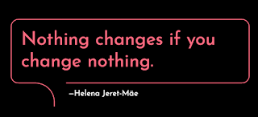

# Framing pain to gratefulness

*Published 2025-01-04*  
*Source: <https://visible-quality.blogspot.com/2025/01/framing-pain-to-gratefulness.html>*

---

Today, I shed a few tears for feelings I needed to let out. Processing those feelings today, giving them the time box they needed was not sufficient but I felt the need of writing about them.

I was in my feelings of pain because I made the final calls for choosing who are the four lucky people who get awarded SeleniumConf Valencia 2025 full scholarships including international travel, accommodation and conference tickets. I know I should be happy for the four, but today I am feeling the pain for the 269 that got listed but received a No.

I volunteer with the Selenium Leadership Committee. This year I was trying very hard not to volunteer with SeleniumConf which is our flagship event, but some things are just too important to not show up for, especially if absence risks them. These scholarships are one of those things for me.

I would like to see a world where all conferences set up a few free places, with or without travel included to change the face of the industry in the conferences. It does not happen from a great and worthwhile idea, but it needs someone doing the work. My tears today were part of that work because the work is not easy. Not doing it is so much easier.

Selenium is a community that has been founded and built with a leadership that understands diversity needs work. I joined PLC because I saw that before my time in action. Talent is distributed equally, opportunity is not. And opportunities can and should be created to balance.

The scholarships have been a part of SeleniumConf concept for some time now, and we do it for bringing participants in for free in hopes of building them up to speakers and contributors in the world. Last summer we also started another form of scholarships, which is for speaking of Selenium with underrepresented voices in conferences other than Selenium.

I feel the pain of organizing 273 brilliant professionals in need of an opportunity, reducing the selection in the end to disabled, black, gay and women. I feel the joy for the lucky four that wouldn't exist without my pain. And working through that pain, I remember again to frame this with gratefulness.

In other communities, I would have first needed to fight for such budget to exist. Selenium project already knows this is necessary. I'm grateful this is a routine we go through.

The work for opening doors needs to be distributed. I am grateful I am in positions where holding the door is possible for me.

With that said, I am looking forward to meeting the four great people that ended up on top of the shortlist. They will make my conference time just a little bit more joyful, and you all joining will be able to meet them as participants just like everyone else. Introducing them to everyone else participating, without the association to underrepresentation that opened the door, will be part of what makes my socially awkward form of extroversion in conferences a little easier.

The change I want to see requires work. If it is a change you want to see, please volunteer for the work. I am happy to pass on the torch in a community that already holds space for it.
