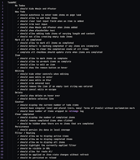
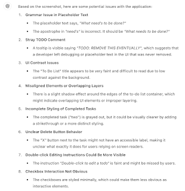
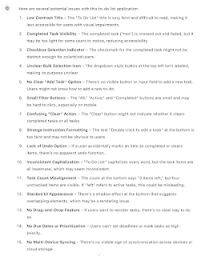

# That Pesky ToDo app

*Published 2025-02-03, updated 2025-02-09*  
*Source: <https://visible-quality.blogspot.com/2025/02/that-pesky-todo-app.html>*

---

While I am generally of the opinion that we don't need injected problems on applications that are already target rich enough as is, today I went for three versions of a well-known test target problem, namely the [ToDo MVC app](https://todomvc.com/examples/backbone/dist/).

Theoretically this is where a group of developers show how great they are at using modern javascript frameworks. There is a spec defining the scope, and the scope includes requirement for having this work on Modern browser (latest: Chrome, Firefox, Opera, Safari, IE11/Edge). 

So I randomly sampled one today - the Elm version, <https://todomvc.com/examples/elm/>.

I took that one since it looked similar to in styles to what playwright uses as their demo, <https://demo.playwright.dev/todomvc/>, while the latest react version already has the extra light styles updated to something that you are more likely to be able to read.

I also took that one since it looked similar to the version flying around as target of testing with intentionally injected bugs, <https://todolist.james.am/>.

My idea was simple:

- start with app, to explore the features
- loop to documenting with test automation
- switch over implementations to see if automation is portable over various versions of the app

I had no idea of the rabbit hole I was about to fall into.

The good-elm-version was less good than I expected:

1. Select all does not work
2. edit mode cannot be escaped with esc
3. unsaved new item not removed on refresh
4. edit to empty leaves the item while it should be removed
5. edit to empty messes the layout and I should not see it since 4) should be true

So I looked at the good-latest-react version, only to learn persistence is not implemented.

And that is where the rabbit hole went deep. I researched the project materials a bit, and explored the UI to come up with an updated list of claims. The list contains 40 claims. That would let me know that good-elm-version was 90% good, 10% not good.

  

Looking at the bugs seeded version, there's plenty more to complain:

1. Typos, so many typos: need's in placeholder, active uncapitalized, toodo in instructions
2. "Clear" is visible even when there are no completed items to clear
3. "Clear" does not clear, because it is really "Clear completed"
4. Counter has off by one error
5. Placeholder text vanishes as you add an item, but returns on refresh
6. Sideways a as icon for "mark all us complete" is not the visual I would expect, nor is the A with ~ on top for deleting - on chrome, after using it enough, but the state normalized on forced refresh.
7. Select all does not unselect all on second click
8. Whitespace trim is not in place if one edits items with whitespace, only when items are shown
9. <!-- STUPID APP --> in comments is probably intentionally added for fun
10. ToDo: Remove this eventually tooltip is probably added for fun as well
11. Errors on missing resources on console are probably added for fun too
12. "Clear" is missing the counter after it the spec asks for
13. usability with clear completed, since its functionality only works on filters all and completed, does it really need to be visible on the active filter
14. URL does not follow the technology pattern you would expect for the demo apps.

In statistics of the listing of features though, the pretty listing of capabilities is hard to map with the messiness of issues:

✓ should show placeholder text

✓ should allow to clear the completion state of all items

✓ should trim entered text

✓ should display the current number of todo items

✓ should display the number of completed items

✓ should be hidden when there are no items that are completed

✓ should allow for route #!/

7/40 (17,5%) does not feel like it is essentially worse but then again, there are many types of problems that the list of functional capabilities does not lead one to.

There is also usability improvement conversation type of feedback, that is true for both the two versions.

1. The annoyingly light colors where seeing the UI and instructions is hard
2. None of these allow for reordering items and it feels like an omission even if intentional
3. None of these support word wrapping
4. usability of concepts "active" and "completed" for to do items is a conversation: are there better words that everyone would understand more clearly?
5. usability with a mouse, there's no adding with a mouse even if that feels by design
6. usability of the whole design of router / filter concept can be confusing, as you may have a filter that does not show the item you add
7. Stacked shadow effect in the bottom makes it seem like there are multiple layers. This does not connect with the filters / routing functionality well.
8. Delete, edit and select all options take some discovering.

You could also compare to what you get from a nicely set up demo screenshot of the bugged version.

  

  

The pesky realization remains: seeding bugs is unfortunately unnecessary. While I got "lucky" with elm-version's four bugs, I also got lucky with the refactored react version that is missing implementation of persistence.

There's also an idea that keeps coming up with experienced testers that we really need to stop throwing at random: SQL injections. For a frontend only application without database, it makes so little sense unless you can continue your story with an imagined future feature where local storage of json gets saved up and used with an integration. Separating things true now and risks for future are kind of relevant in communicating your results.

Playing more with the automation is left for another day. The 9 tests of today were just scratching surface, even if they 100% pass on playwright practice version and don't on any of the others.
