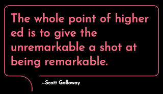

# The Art of Framing

*Published 2025-06-28*  
*Source: <https://visible-quality.blogspot.com/2025/06/the-art-of-framing.html>*

---

There's an actively harmful institutionalized practice in the world of testing: ISTQB certifications. It is one of those institutions at this point of my career that I am risking more than I can ever hope to gain to speak against it, and my realistic option to speak against it is to make it extra personal.

I'm well aware that for my work, I have customers who, much to my dislike, require ISTQB certifications from our consultants. I have lots of colleagues with those certifications, I just calculated that we have 30 individuals with **Advanced** level certifications, just like I counted that while I am one of the 30 individuals, I have now 4/4 of the Advanced level certifications.

Yesterday I added ISTQB Advanced Test Automation Specialist certification on myself, because yesterday it awarded my employer 1 point more for a bid with a deadline at 4pm. I got mine at 2pm so that I would do everything in my power to ensure me and my lovely colleagues have a chance to work for next five years.

I wasn't the only one working to get the certificate. I had 8 colleagues who worked on the certificate. They supported my learning by showing up to do five 1h ensemble learning sessions where we learned to answer as the test requires, even when that is incorrect advice for real projects. Being a social learner, those 5 hours of failing to answer right in front of my peers were how I became certified.  I was particularly proud of a colleague who, while being an excellent tester and test automator with 5 years of experience, struggles with the type of learning the certification requires you to complete. They used full working days for four weeks on intense study to go through both Foundations and Advanced Test Automation, and while they failed on the latter, they will get through it soon.

ISTQB certifications are a harmful institutionalized practice, because none of us who want work for next five years are powerful enough to walk away. If our customers choose us based on it, we jump through the hoops of getting it. Our customers choose what training our people get, and it is harmful that they choose this. Because this does not create good testers. There are real options that create good testers, and they only don't choose those, but because of the system of having **limited budget** for training, they choose they don't get people with the right courses.

What are the right courses then? Well, anything that I have taken that has grown me into the guru I am now. I still say guru with a tongue in cheek, because while I know that I do good testing and design good groups of people who do testing, I'm not a guru. I am someone who being rather unremarkable, got the change of being remarkable.

Education and learning is my gist. I promote it, I work for it. Because we need something better institutionalized than this ISTQB certification stuff. I am where I am because I learn. And I will become more deserving of guru because I am not done learning.

All of the above is how I frame why I choose to show up every now and then to share a perspective against ISTQB while establishing that I know the contents, not just from research but being able to pass that mark. I quote my credentials because the customers who I hope will learn to ask for something better don't know me for guru, they know me for a tester. And testers aren't high and mighty. Even the ones who are gurus are bottom feeders in the overall hierarchy of roles.

I remind people that:

- I am one of the authors of ISTQB Foundation Syllabus - and my effort of making it better were undermined for **business reasons of established training providers**
- I hold copyright that I never passed on to my work on ISTQB Foundation syllabus. They sent me a contract and I never signed. No matter what they write in the forewords, it is a lie and reflects on how they operate
- I have limited time and I choose to be **for not against** and I am for better use of our learning time. Go to conferences. Take BBST courses. Support independent course providers by taking their courses. Your people will do better work if you make better choices.
- I hold ISTQB Foundation certificate (CTFL), ISTQB Advanced Test Manager, ISTQB Advanced Test Analyst, ISTQB Advanced Technical Test Analyst and ISTQB Advanced Test Automation Engineer certificates. I passed them by learning to answer as they wanted, not what is right.

Credentials are to establish that I have done my fair share of learning what I speak about. And I speak about giving the month of learning time for my colleagues to do better courses.

There is something I have that many of my colleagues don't, and it's not the guru status. It is a support network that allows me to do first work and then an equivalent of learning on my own time. I am not bound by the same budget limits because I have made a choice 20 years ago to use my holidays and free time on speaking at conferences. I consider reading professional books fun pastime. And I acknowledge that this choice, being a single mom of two kids, from a family with single mom and six kids, required an exceptional support network in my extended family.

Most of us get one course a year, and we need to make good choices. With ISTQB institutionalized as it is, the choice is harmful for our industry.

All of this is a long response to a comment from a colleague that this time was brave enough to leave the comment visible long enough I could read it. The two previous ones I could guess had a similar sentiment of hating me and framing me with much less cause than I do.

We need better institutions. And while I may use me to get the message across, I also chose my current position to get the message across to more people that matter. My colleagues can get daily education and I use my power, the bit that hold internally on answering all the questions of non-tester managers asking how to support their brilliant testers on their growth paths.   

No matter the platform I am on, I am dragging people to stand there with me if they want it. And generally speaking, we want to do well at our work. My metric is now how far I have climbed, but how many people I get to climb with me.
