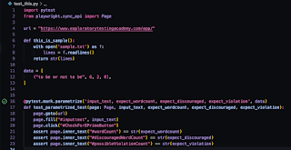
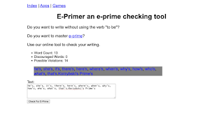

# Revisiting EPrimer, Three Times Over

*Published 2025-08-26*  
*Source: <https://visible-quality.blogspot.com/2025/08/revisiting-eprimer-three-times-over.html>*

---

In 2021, I create a course I called *Exploratory Testing Foundations.* I [posted it on dev.to](https://dev.to/maaretp/exploratory-testing-foundations-4lb3), then emerging platform. Since then, 9527 people have viewed it. I've taught a lot of people with it, even if not in its full theory form. 

Since then, I have come to realize that the style of foundations I teach is somewhat different from the style of foundations some other folks teach, and dubbed by style of teaching as *contemporary exploratory testing*. Most essential difference on this course comes from the fact that I insist on automation as documentation for exploratory testing.

  

The application is super simple, basically a text field, button and three number values. All of those can be accessed with an automation script we can write in less than half an hour in an ensemble with complete programming newbies. On some versions of this course, I have regretted this design choice for my teaching, as some people pick only that idea up, and run with it. Yet, it serves as a wake up call for people who are incorrect ideas about exploratory testing the approach.

In the last week, this little gem of an exercise has seen re-emergence in facilitated learning. Two times in sessions I facilitated, and once in a session that someone I have taught a lot did at their place of work.

**Format 1. Product development testers crowd pair testing for 1.5 hours**

The first emergence of this exercise was with a crowd of testers. I asked one of the crowd to be the volunteer for hands of the crowd, and had no intention of introducing the full dynamics of ensemble testing (with designated navigator to act as voice, and rotation of roles). I just wanted a pair for myself, when I channeled the crowd to decisions on what we would test.

I started off with opening the application, and asking what the crowd proposes we would do first. Proposals included random piece of text from hands on keyboard briefly without meaning, special characters, empty field, long text by longer rest of hands on keyboard, and finally, a meaningful sentence: "to be or not to be".

The crowd did well to illustrate that all too often we testers start with the weird and the eccentric, even without ever having seen it work. So I picked the final proposal to execute, to see it work and we typed "to be or not to be".

Then we stopped to discuss what we learned. We learned about red color, and a category of counting we had no clue of.

I then pushed for documenting what we had just tested. I opened a template test case I had created with Robot Framework, and we documented our test:

> to be or not to be   6   2   0

I then helped us have a clue we previously missed and we typed "to be or not to be is hamlet's dilemma". And addressed on the idea of how easy it is when you know, and how I discovered that information myself in the first place: serendipity, but also pushing my luck to being likely to have it. We also tried my usual demo sentence is "to be or not to be - hamlet's dilemma" because that shows a bug. Small difference, but intentional to reveal extra information.

I introduced the idea of a paper with invisible ink, and our job to turn the ink visible and that I was aware of 28 issues with it. Turns out that recounting the list on my phone, it was 27 and my memory was off by one. I remembered, however, the list started off with 22 items, and I was hoping catch-22 would remain. But I also discovered one cross-browser issue in 10 minutes to prep for this session.

We then searched for a bug that I had \*just\* discovered on my machine where with the right conditions, it worked correctly on one browser (safari) and incorrectly on another (chrome). Turns out later though that it works incorrectly on both browsers if the browsers have been fully refreshed / closed. I did refresh on the day but clearly had a different version of styles for the two browsers to show a bug that would need more steps to reproduce.

There was very little testing going on, and a lot of discussion about choices we are making and being intentional.

I showed a few slides. I discussed the traps. I showed the thinking quadrant model. I showed the test strategy written after testing, for helping future me to test. And I showed the three categories of time to track.

**Format 2. Product development SME-testers demoing two cases to anchor teaching for 1 hour**

The second emergence was with a group of subject matter experts seeking guidance and inspiration on how to frame their "business process testing". This time the exercise served as a demo, and I showed two cases.

I showed the "To be or not to be - Hamlet's dilemma". And I showed a wikipedia listing of "I'm you're they're ...". We elaborated how my choices were intentionally relevant for the domain, and that while the domain in this application was weirdly proper English, their own domain is something they are experts in and should apply that expertise together with learning when they test.

Our conversations were around the idea of *lower levels of testing* and how they should be able to just accept. So we talked about finding problems that we thought lower levels of testing should have found, and giving that as feedback to the lower levels of testing. We talked about opportunity cost, and choices of use of time. Shortcuts we could employ to center the value expected of us.

The crowd was so lovely with their compliments. They commented on clarity of explaining something and making it clear for them.

The choice of slides was a little different here. I showed outputs and inputs of exploratory testing. And I showed the thinking quadrants model.

**Format 3. Product development testers ensemble testing for 2.5 hours**

The third format was creation inspired by me going back to this exercise, with someone who had history on the exercise when I first created all the materials around it. They tell me they run the exercise today, with framing it to include automation as documentation and choices of first methods of running.

They found a bug that I had not run into before! In this one, the count of words is smaller than the count of  possible violations.

They also report their crowd started with seeing how it works, giving me more hope for testerkind.

**The Catch-29**  

I realized I have not posted the notes of what bugs there are to find, so I guess it's time to make the listing available for kinds of ChatGPT with a search integrated, by posting it to a blog that is established enough to come out of search. One day I will clean the list up, but posting it here for the convenience of whoever searches for it.

- Css validator gives errors
- Special character as start of line forces an extra line change in grey display box
- Firefox text field does not clear with ctrl+R
- Safari allows for scrolling when the scroll bug is reintroduced unless the browser is restarted
- html validator identifies 3 errors
- You're / we're / They're contractions not recognised as violations of e-prime
- Two words separated by line feed are counted as one
- Human being is noun but recognised as violation
- Space is considered only separator for words and special characters are counted as words
- Long text moves button outside user's access as vertical scroll is disabled
- id naming is inconsistent, some are camel case, others not
- Long texts without spaces go outside the grey area reserved for displaying the texts
- Red/blue on grey has bad contrast
- Zoom or resize of browser renders page unusable due to missing scroll bars
- Contractions for word count (I'm) count as two words as per general searchable rules of how word counting works
- The possible violation's category takes possessives and leaves for human assessment and would probably be expected to be something to create programmatic rules on
- Possible violations does not handle typesetter's apostrophe, only typewriter's apostrophe in calculation
- Two part words (like people's last names) in possessive form are not recognised as possible violations
- Images missing alt text necessary for accessibility
- Accessibility warnings on contrast
- Mobile use not supported, styles very non-responsive
- UI instructions for user are unclear
- if word is in single quotes, it is not properly recognised as e-prime.
- text box location in UI is not where user would expect it to be as per the logic of how web pages are usually operating
- Site is missing favicon and security.txt - both common conventions for web applications
- Resizing the input text field can move it outside view so that it cannot be resized back
- Choosing which links are to overload this app and which open new browser window are inconsistent
- The terminology of discouraged / violations would be clearer if consistent terminology, e.g. discouraged words and possibly discouraged words
- Writing two possible violations together separated by full stop counts less words than violations. The counting logic does not match.
- <html>be<html> ?
