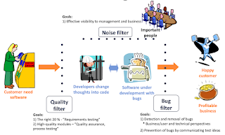

# Feedback and Actions

*Published 2025-10-24*  
*Source: <https://visible-quality.blogspot.com/2025/10/feedback-and-actions.html>*

---

Back in my early days of testing, a common storyline was that we were messengers with information, and we would leave it for others to decide on what they would do with that information. Over the years, it started to bother me.

We, testers, were taught the fine art of formulating our information as questions, leading those with decision power to the insights. Creating shared ownership is a great idea. We were taught to put some extra effort in our information, particularly about problems so that we would pay attention to tone, the framing of the information to as important as possible, with clear steps, all because we knew we would be addressing people who may already be overloaded, jump to conclusions, and frankly these days, if there was no need of enriching the text that gets produced, we would just throw it all at genAI.

What was missing with information and not taking a drivers seat was the in framing the information, we already took the drivers seat. For us to do our job well, we needed to frame the work as less passive providers of information to providers of **actionable feedback.**

While the common way of distributing the work between roles is still that testers tend to stop at feedback and not take the actions, we also learned from practice that the more we blurred the line on task basis, the more we allowed for growth. We started sharing testing work to those who weren't testers by trade, and we started picking up actions to improve quality - modeling quality in practical ways for common understanding, describing risks of relevance, and optimizing our feedback cycles; building culture where we care about quality, have shared practices, deliver and receive training, and set out quality gates.

I don't want to talk about what is testing, quality assurance or quality engineering. I want to talk about feedback and actions, and unless that pair exists with a good connection, we easily invest in feedback that we did not want or need.

As years go by and my experiences and observations pile up to patterns, the decision-avoidance becomes one of the things I counteract explicitly when discussing **contemporary exploratory testing.** At the same time, I note that the ideas of us testers as feedback professionals with agreed scopes we work on emerges.

The bugs I find these days are about two organizations not being able to collaborate for reuse, thus building things I ways that don't always have a positive impact on how the users get the experience the world of software. How one organization with right decisions can fix critical problems to thousands of organizations by not only fixing a thing for themselves, but working together upstream to get the fix right where it belongs so that it becomes an asset for everyone to benefit from.

For almost 30 years I have been a tester. A tester of products, practices, people and organizations. I've come to call myself a feedback fairy, and I have come to recognize that what I expect to do is actionable feedback. I call that testing and say testing is too important to be left for just testers, but also too important to be left without testers. Feedback and actions are pair.

