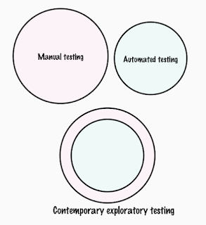
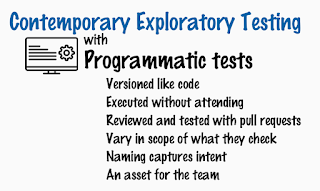

# Dual-purpose Task Design

*Published 2025-11-07*  
*Source: <https://visible-quality.blogspot.com/2025/11/dual-purpose-task-design.html>*

---

Dual-purpose thinking is big in the world right now. Dual-purpose technologies are innovations with application for both civilian and military uses, such as AI, drones and cybersecurity perspectives with any software we rely on. A few mentions of these in a conference I was listening in to, and my mind was building connections to using dual-purpose to explain exploratory testing.

In the last weeks, I have found myself explaining to my fellow consultants that *our CVs do work for us when we sleep or work on something else*. I started explaining this to help people see why they should update their CVs, and what I see in the background processes. We get requests to let our customers know the scale of certain experiences, and we collect that information from the CV collections. Those CVs have a dual purpose. They serve as your personal entry to introduction with interesting gigs. But they also serve as a corporate entry to things that are bigger than the individual. Usually without us having to actively work on them.

Today, as I was ensemble testing a message passed through an API and processed through stages, I realized that dual-use thinking is something core to how I think about exploratory testing too.  I design my testing tasks so that instead of them being separate, they are dual use. I optimize time by actively seeing the overlap. And it saves me a ton of trouble we were facing today.

I described this in a post on LinkedIn:

An ensemble testing session today showed the difference between manual testing, automated testing and contemporary exploratory testing in a fairly simple and concrete way.   
  
Imagine you are testing with a message to API, with the three approaches.  
  
Manual testing is when you run the message through postman. You get confused on what values you changed last because you did not name your tests for whatever you tried just now, there was no version control and information on what value X means is held in your head. The baseline versions of these you carefully document in Jira Xray, but not with the message. That you create manually from templates whenever you need it.   
  
Automated testing is when you spend significant time in creating the message with whatever keywords you have, and then verifying the right contents with whatever keywords you have. Because of the mess of keywords and rules around how carefully these must be crafted to qualify, from a combo of values in a message to automated testing, there's quite a distance.   
  
Because the first is fast and the second is slow, you carefully keep the two of them separate by having separate tasks. Maybe even separate people, but even when they are both on you, intertwining the two is not an option.   
  
I push for the third option that I keep calling contemporary exploratory testing. Edit your messages in version controlled files in VSCode. Send them over with simple or complicated key keywords. The main point is you can leave your new combinations behind in version control as you discover them. Structure them towards whatever has all the right checks in place when the time is right, but build ways of structuring and naming that help document the concepts your inputs and checks have. See that you are building something while exploring that helps you refresh your results.

This all summed up as a picture with texts on the ideas I was working through. I seek ideas that are beyond what I see in day to day, hands-on testing with people capable of "manual testing" and "test automation". I seek Contemporary Exploratory Testing with Programmatic Tests. 

