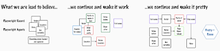
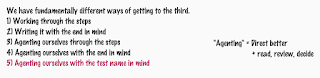

# Observations of a habit transformation

*Published 2025-11-28*  
*Source: <https://visible-quality.blogspot.com/2025/11/observations-of-habit-transformation.html>*

---

A month ago, I gave a colleague an assignment. They were to create typescript playwright automation using Github Copilot and Playwright Agents. While making progress on the tests was important, learning to use agents to support with that work was just as important.

We had a scope for a test, which was one particular scenario previously created with a recording style automation tool. Recording took usually an hour, but there was no fixing the script. Whenever it would fail, a rerecording was the chosen form of maintenance. No one knew anymore if the thing that was recorded now matched what was recorded when the test was originally imagined. The format of the recording was an xml pudding where pulling out things to change took more effort than anyone had been willing to invest.

Halfway through the month, I checked with how the work was progressing to learn that it had seemed easier to work without agents due to familiarity. With a bit of direction that was no longer an option for continuing.

Three days before the deadline, I checked with how the work was progressing to learn the scope of the test had been forgotten and something new and shiny was being tested, mostly for playing with the Playwright Agents. With a bit of direction the scope was done by the review meeting.

Yes, I know I should be checking in more frequently. That option however was not a possibility.

Looking at what got done, I learned a few things though.

I learned that 134 LOC was added into 8 functions.

I learned three new significant capabilities (env configuration, data separation and parametrization, and fixtures) were added, and the scope of what the intended design of the original test had been had been captured.

I learned that making test reliable by adding verify for waiting to be at right place before proceeding had taken significant amount of work.

I learned that one type of element was never seen by the Playwright Record tool, and that required handcrafting the appropriate locators.

I learned that using agents comes with more context that I had not fully managed to pass on. If your agents out of the box are called planner, generator and healer, the idea that you might want to skip the planner or even write your own just following the existing as examples was not straightforward.

Seeing this unfold in hindsight from the pull requests, I modeled the process of how it was built.

  
First things were either recorded or prompted out after AI. Recording was clearly the preferred, controllable way of starting.

Then things were made work by adding things recording did not capture.

Then a lot of work was done on structure and naming.

There was a few iterations of making it work and making it pretty.

So I compared notes with some of the other assignments like this that I have given to people.

There were five essentially different ideas of how work like this would get done.

1) **Working through the steps** of something, make it work, make it pretty, was a preferred method for newer automator.

2) **Writing it with the end in mind** was usually a choice of a more seasoned automator

3) **Agenting ourselves through the steps** was again a preferred method for a newer automator, producing insufficient results.

4) **Agenting ourselves with the end in mind** seemed to produce better results for directing for agentic style of writing (reading, reviewing and deciding on new directing) style of tests

5) Agenting ourselves with the test name in mind was the aspiration but steps to walk through have some more maturing to do.

So today, I wanted to make a note of a theory - how you frame your steps and what is your model decomposition of work will greatly impact the outcomes you get on this style.
