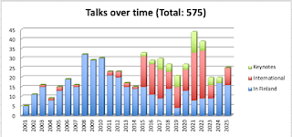
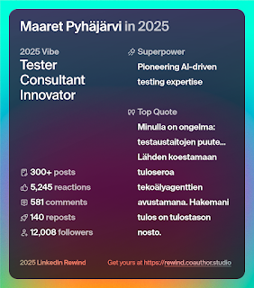

# Routines of Reflection 2025

*Published 2025-12-31, updated 2026-01-03*  
*Source: <https://visible-quality.blogspot.com/2025/12/routines-of-reflection-2025.html>*

---

As I woke up to a vacation day 31.12.2025, a thought remained from sleep: I would need to rethink the strategies of how I use my time, and how I make my choices for the next year. I was trying to make sense into the year we are about to leave behind, and I knew that if there was a word I would use to describe it, it would most likely be **consistent effort.** On holidays and weekends, the consistent effort was into reading  and I have been through more books in a year than I have read in the last ten combined (fiction, 51 titles on Kindle finished in 2025 and 73 in 2024, starting on the week I turned 50). On work, it was whatever was the theme of the week / month / quarter and I had adjusted direction learning so much throughout the year.

While efforts feel high and recognizable, I am not convinced with the strategies behind those efforts, and particularly the impact that I am experiencing or even aspiring. I am, after all, in a lovely unique career position where I have a lot of power over choices we make on testing, in an organization where I have a lot of learning to do on how to work on power with people, and particularly power with other organizations. Consulting, and my role in the AI-enhanced application testing transformation force every day to be one full of learning.

**Describing the effort**

As consultants, we track our hours used, leaving me with data of my year at work.

So know that I used **7%** of my annual work hours **on receiving visible training**. This included:

- Participating in conferences I did not speak at: Agile Tampere, Oliopäivät Tampere, Krogerus Data Symposium
- Classroom training on Sales (did not like this), Delivery framework (liked this), start of Growth training (loving this).
- Ensemble learning for ISTQB Advanced Test Automation -certification and completion of full set of four Advanced certificates.
- Ensemble learning for CPACC Accessibility certification and completion of the certification, with start of accessibility advocacy that comes with holding the certificate without exam every five year.

I was on a **sick leave 3%** of my annual used hours. This feels more than usual, but still only 6 days. Two very classic flu that my mom always said takes 2 weeks or 14 days to recover from, whichever comes first.  One bout of backpain when forced to adjust back to office and different ergonomic. I guess this is the investment of meeting more people face to face again.

**39%** of my hours I have done something where we specifically agreed on something I would **deliver for the clients**, and the customers would pay for it. Those hours were split between six distinct customers. Thematically people paid me to transform stale testing organizations, teach contemporary exploratory testing, introduce and improve test automation and AI, bring in throughput metrics, and to test in projects where others before me had not managed to find the problems customers would have to find.

That leaves **51%** of my efforts into two categories of ***admin* and *proposal***. Admin is when we run our own organization, and that took 20% of my time. I have direct reports, and I testing community of excellence to facilitate. I hired 4 people in 2025. Proposal is when we are creating partnerships with the clients but they aren't paying for that work, and it was 31% of my effort. On proposals, I worked with 72 organizations out of which 51 clients, 17 partners in delivery for the customers, and 4 internal customers.

You can guess from the numbers that this was particularly challenging. I learned to take notes, categorize and model problems and solutions through consistent practice. And I appreciate the window into the challenges of testing that the work I hold now offers. If only I could figure out how to better turn it into impact - and I will.

Proposal category included also all of the public speaking I did that was not paid, which was 23/25 sessions I delivered in 2025.

  

I spoke on:

- AI, particularly Agents in GitHub Copilot for non-automation use cases
- Python, teaching a 8-piece series of python for testing at work instead of complaining for same amount of time that some people did not know the basics - they do now.
- Contemporary exploratory testing, seeing versatile problems in target applications and combining automation into it

A particular learning event that of the year was making a typo worth 24M euros, a definite gem to my collection of costs of bugs. That story gets better as soon as I prove that without the typo, the 24M would have been ours and I may need another year for that. :D

**Socials**

The year on social media was interesting. I got to feel the split on multiple dimensions.

I was on Mastodon (a lot!) and LinkedIn, and I missed the time of Twitter. On Mastodon, I tallied to 1.1K followers and  4.2K posts. On LinkedIn, I tallied 12,008 followers, 778,849 annual impressions (-34.1% less than previous year). I blogged less than before, and had 314K views taking the total now to 1,422,454 page views.

I was in Finnish and English on LinkedIn, and missed the possibility of just picking one.

I learned that a fairly popular blog with consistency showing up combined with AI makes AI answer my kinds of questions better, without referencing me. If you care about work (results) over the credit, best ideas win - never been more true.

**Challenges**

As we all should know, movement is not work. Effort alone does not bring impact. So I find myself making a tally of the challenges.

1. Level of testing skill
2. The controls at scale organization, allocation and targets
3. Sense of agency with understanding of impacts

If there was a theme of insights this year solidified, it was the insight on lack of testing skills *in testers*. There is a little too much reliance on external sources or serendipity, and a little too little of intentional search for relevant information and continuously improving testing systems. With the exceptional levels of educational materials available, the level of this information turned into practice continues to be a challenge. The issue has grown over time since testers are, due to various transformational reasons, more often one in a team of developers.

To address something in scale is a whole another problem. I learned about changing organizations in practice and how organizations, money allocation and target setting are tools of scale that I have been so bad at and need to learn more on. I have focused on problems of information and examples, but I need to solve the frame that allows people to change.

There's a lot of learned practices of weaponized helplessness and lack of seeing systems for own impact that means a lot of people find themselves smaller cogs in the system than I would believe they have power on. Our ideas of what is possible and what is safe, and what is mine to change or even comment on have a significant impact on what we are capable of achieving together.

**Impacts**

I'd like to think that some of the testing advice or inspirations I have provided this year have impacts that I only learn later on. Kind of like receiving a message this year from two people I worked with 10 years ago, one telling that I still impact their career on a regular basis due to the timing of when our professional paths crossed, and another telling me their organization has now better diversity mechanisms because our time together was one where I invested effort into letting people know I am not "guys" and that I would risk personal negative consequences for working for social justice.

So with all the reflection, I leave a call for myself and the community around me on finding out ways of fixing challenge 1 - skill of testing. While I have a sense of need of personal contribution in that space, I also know that the only way we solve problems in scale is democratization of knowledge and working together. So that is up next, going for 2026.

**Closing off**

I still think my reflection wins over what social-media-based AI tools can do. Top quote is my challenge 1.

And me on [Github](https://mas.to/@maaretp/115826668132664194) (screenshot on Mastodon). My work is not on Github.
